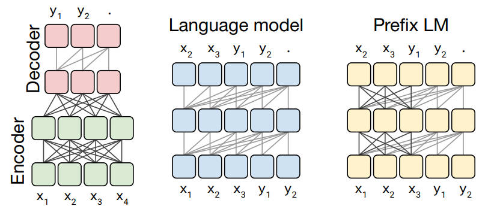
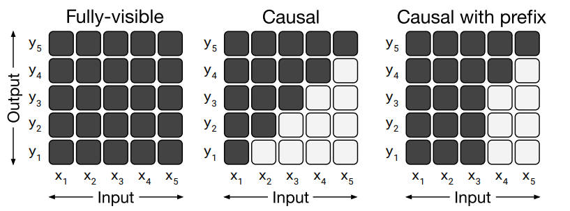
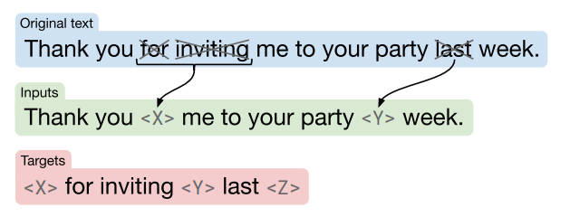
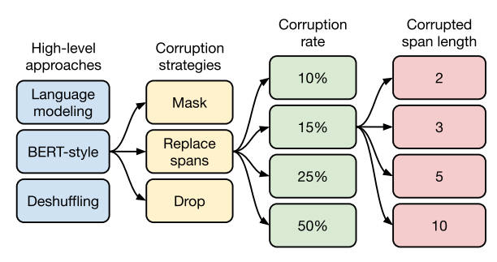
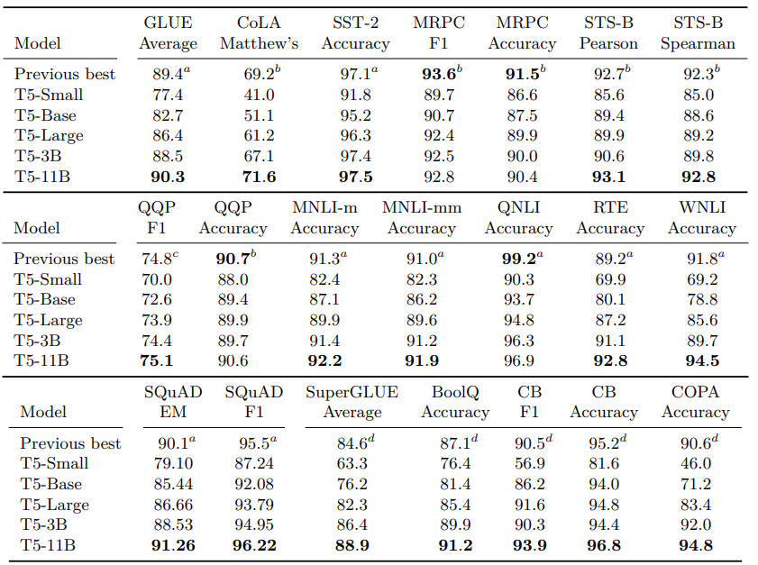

### 【零】模型介绍

***

> Google 于 2019 年推出的预训练模型，核心思想是将所有的 NLP 任务 "大一统到 seq2seq 架构" 中

> T5本身没有什么算法上的亮点，也没有模型结构上的巨大创新，它最重要的作用是为NLP预训练模型提供了一个通用的框架, 就是"万物皆可seq2seq"

***

### 【一】训练流程

***

> T5 模型在训练和应用时候的套路是一样的，并且和下游任务一一对应，非常清晰

* **英德翻译**：假设我要把英文文本 "That is good" 翻译成德文，只要把输入数据转换成 "translate English to German: That is good"，直接输入模型中，模型的输出就是翻译后的德文"Das ist gut".
* **情感分析**：假设我当前要对文本 "This movie is terrible!" 进行情感分析，只要把输入数据转换成 "sentiment: This movie is terrible!"，直接输入模型中, 模型的输出就是分析后的结果 "negative".
* **STS-B(文本语义相似度任务)**：原始的任务可以认为是一个回归任务，因为需要得到一个连续值. 但是 T5模型 以每 0.2 为一个间隔，从1分到5分之间分成 21 个离散值, 转换成了 21 分类任务. 比如架构图中的那个 3.8 其实并不是 "浮点数值"，而是 "字符串文本"，本质上是一个分类标签.

***

### 【二】训练数据集

***

> 从Common Crawl (一个公开的网页存档数据集，每个月大概抓取 20TB 的互联网文本数据) 中清理出了 750GB 的训练数据

> 大名鼎鼎的 C4："Colossal Clean Crawled Corpus"，寓意 超大型干净的爬虫数据集

- 1：只保留结尾是正常符号的行.
- 2：删除任何包含脏词汇的页面.
- 3：包含 JavaScript 词的行全部删除.
- 4：包含编程语言中常用的大括号的页面全部删除.
- 5：包含任何排版测试的页面全部删除.
- 6：连续三句话重复出现的情况下，只保留一行.

***

### 【三】预训练策略

***

#### 【3.1】预训练架构

***

> 经过作者大量的对比实验后，发现第1种 Encoder-Decoder 架构效果最优， 因此T5模型中采用了第1种架构.

- 第1种：Encoder-Decoder，即大家熟悉的 seq2seq 架构，分为编码器和解码器两部分. 对于 Encoder 可以看到前面，也可以看到后面. 结果作为输入传递给Decoder. 对于 Decoder 只能看到前面的信息. BERT 可以看做只有 Encoder 的模型.
- 第2种：相当于只有 Decoder 部分，只能看到前面的信息，典型代表就是 GPT2 模型.
- 第3种：Prefix LM，前缀模型，可以看成是 Encoder 和 Decoder 的融合体，一部分等效于 Encoder 可以看到前面，也可以看到后面，另一部分等效于Decoder 只能看到前面的信息.

***

#### 【3.2】Mask 机制

***

> Mask 机制对应如下

***

#### 【3.3】Mask 策略

***

> Mask 策略如下，BERT-style + replace-span 效果最好

* **宏观视角**：
  * 1：GPT-style，生成式语言模型的方式，类似于GPT2，从左到右预测.
  * 2：BERT-style，MLM的方式，类似于BERT将token遮掩掉，然后再还原出来.
  * 3：Deshuffling-style，将文本顺序打乱，然后再还原出来.
* **微观视角**：
  * 1：token mask法，即直接将单个token替换成[MASK].
  * 2：replace span法，可以将相邻的若干个token合并成一个[MASK].
  * 3：drop法，没有替换操作，直接将随选定的token删除掉.

***

#### 【3.4】训练数据百分比

***

> 按照前面选定的策略，最后一步就是确定一下训练语料中多大比例的文本参与这种 MASK 策略：15% MASK 比例 + Span 为 3

***

### 【四】模型版本效果

***

> 相比较之前的 RoBERTa 和 AlBERT 的 SOTA 基线，T5 模型的 Small，Base，Large 并没有什么突出表现，几乎在所有的基准测试中全部处于下风. 

> 到了 3B 版本才有接近于 Previous Best 的表现. 直到继续暴力拉升到 11B 的参数版本, 才显示出T5模型的优势. 

* **Small**：Encoder 和 Decoder都只有 6 层，隐藏层的维度取 512，head=8，参数总量60 million.
* **Base**：Encoder 和 Decoder都采用 BERT-base 的参数，参数总量220 million.
* **Large**：Encoder 和 Decoder都采用 BERT-large 的参数，但层数保留 12，参数总量770 million.
* **3B**：在 BERT-large 的参数基础上，层数采用24层，参数总量 3 Billion.
* **11B**：在 3B 参数基础上，FNN 和 head 选取的更大，参数总量 11 Billion.

***

