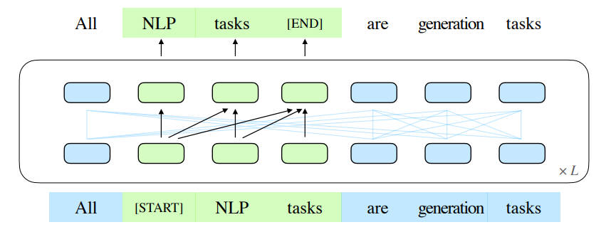
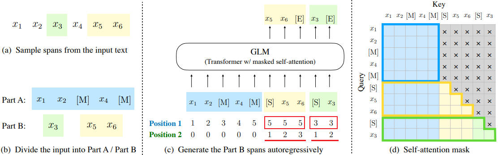
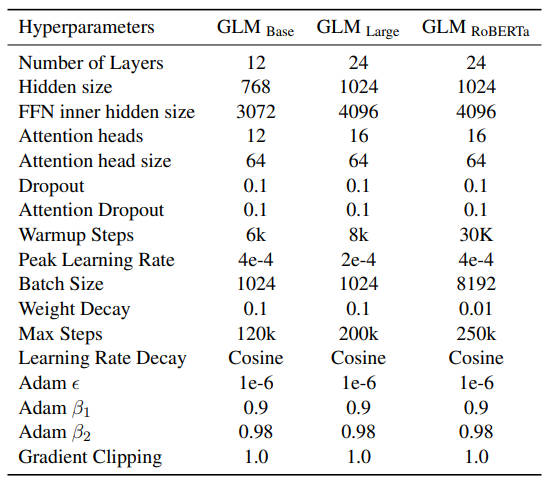
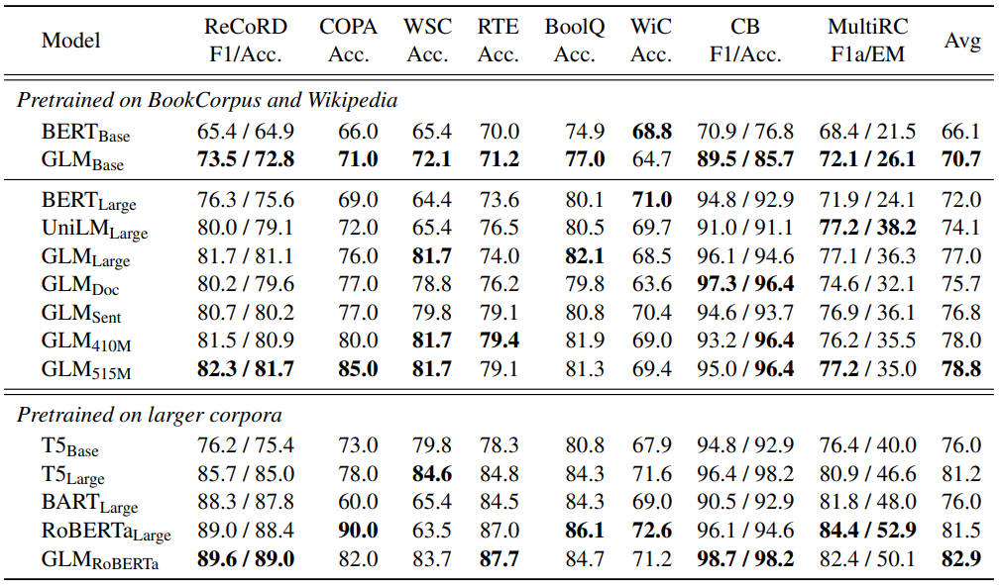

### 【零】模型介绍

***

> 智谱AI（围绕清华 KEG 和 THUDM）的大模型，在最近两三年（2021-2024）的时间内迅速迭代（包括架构层面），开创了 GLM 大模型家族

 

> 在 GLM 迭代过程中，模型架构层面的变化还是挺大的，这点需要注意下，现在变成了类似 llama 的纯 Decoder 架构

***

### 【一】GLM 1

***

> 智谱AI 在 2022年 发布的大模型：基于自回归空白填充的通用语言模型（GLM）

> 论文：[GLM: General Language Model Pretraining with Autoregressive Blank Infilling](https://arxiv.org/pdf/2103.10360)

#### 【1.1】核心结构

***

> GLM 通过增加二维位置编码并允许以任意顺序预测跨度来改进空白填充预训练，这在 NLU 任务中实现了超越 BERT 和 T5 的性能提升。

> 与此同时，GLM 可以通过变化空白的数量和长度来预训练不同类型的任务。在跨 NLU、有条件和无条件生成的广泛任务中，GLM 在相同模型大小和数据条件下优于 BERT、T5 和 GPT。

 

* (a) 原始文本为 [x1, x2, x3, x4, x5, x6]，随机采样了两个跨度（spans）[x3] 和 [x5, x6]
* (b) 在 Part A 中，用 [MASK] 标记 [M] 替换采样的跨度，并在 Part B 中对跨度进行洗牌（shuffle）
* (c) GLM 自回归地生成 Part B，每个跨度前添加 [START] 标记作为输入，并在后面附加 [END] 标记作为输出，二维位置编码表示跨度间和跨度内的位置
* (d) 自注意力掩码：灰色区域被遮蔽。Part A 标记（蓝色）可以内部互相关注，有助于模型捕捉文本内部的上下文信息，但不能关注 B。Part B 标记（黄色和绿色）可以关注 A 和 B 中前文，这种设置允许模型以自回归的方式生成文本，同时考虑到已经生成的上下文

* GLM 使用的短跨度（λ = 3）掩码的训练，适用于 **自然语言理解（NLU）**任务。为了在一个模型中同时支持 **文本生成**，作者提出了一个多任务预训练方法（以第二目标共同优化文本生成任务）
  * 文档级：从均匀分布中采样，其长度为原始标记的 50% 到 100%。该目标针对长文本生成。
  * 句子级：采样严格保证必须是完整的句子，总采样覆盖原始标记的 15%。该目标针对 seq2seq 任务。
  * 这两个新目标与原始目标定义相同，唯一的区别是跨度的数量和长度。

***

#### 【1.2】预训练参数

***

***

#### 【1.3】实验结果

***

 

***

