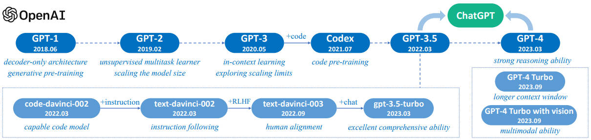

### 【零】模型介绍

***

> OpenAI 宇宙最强模型 

***

### 【一】GPT 技术演进

***

> GPT 的演进还是非常坎坷的，但信念感非常强大，不得不服

 

***

### 【二】LLM 范式

***

> OpenAI 引领的生产级 LLM 范式，站在巨人的肩膀上深入了解下整个范式流程

#### 【2.1】万亿级 Token 预训练语言模型

***

> **阶段一**：预训练

> **目标**：下一个单词预测任务（自回归）

***

#### 【2.2】有监督指令微调（SFT）语言模型

***

> **阶段二**：高质量人类标注的指令和文本精炼语言模型

> **目标**：获取更好的 Prompt 和生成质量

> **数据集**：以下列出几个可以直接使用的指令微调数据集

* [alpaca](https://huggingface.co/datasets/tatsu-lab/alpaca)：
  
  通过 self-instruct 框架，使用 OpenAI 的 text-davinci-003 模型（已下线）生成的包含 52,000 条指令和文本的数据集。用于对语言模型进行指令微调 （Instruction Tuning），使大语言模型更好地响应 Prompt。
* [databricks-dolly-15k](https://huggingface.co/datasets/databricks/databricks-dolly-15k)：
  
  数千名 Databricks 员工按照 InstructGPT 论文中概述的类别生成的 Instruction 数据。这些行为类别包括头脑风暴、分类、封闭型问答、生成、信息提取、开放型问答和摘要。协议非常友好，CC BY-SA 3.0 license，可用于任何目的，无论是学术还是商业。
  
  OpenAI InstructGPT 数据比例：文本内容生成（45.6%），开放式问答（12.4%），头脑风暴（11.2%），聊天（8.4%），文本改写（6.6%），内容摘要（4.2%），封闭式问答（2.6%），文本内容分类（3.5%），其他类型（3.5%），关键词提取（1.9%）
* [oasst2](https://huggingface.co/datasets/OpenAssistant/oasst2)：
  
  OpenAssistant 是 LAION （非营利性组织，因 Stable-Diffusion 数据集出名）发布的一个基于聊天的助手，它能理解任务、与第三方系统进行交互，并动态地检索信息来完成任务。OpenAssistant/oasst2 数据集的发布旨在让每个人都能建设和使用强大的 chat-based 的大语言模型，一共收集了来自超过13,000名人类的真实聊天数据，包含信息树和标签。

***

#### 【2.3】使用 RLHF 实现人类价值观对齐

***

> **阶段二**：使用强化学习训练大语言模型

> **目标**：将模型⽣成结果与⼈类价值观/偏好/习惯等对⻬（更像⼈话）

***

### 【三】RLHF

***

> 模型成功的关键，将模型⽣成结果与 ⼈类价值观 / 偏好 / 习惯 等对⻬

* 出自 [InstructGPT](https://arxiv.org/pdf/2203.02155) 论文（三步训练法）：

* 出自 2023 年底的 [LLM综述](https://arxiv.org/pdf/2303.18223)（三步训练法）：

#### 【3.1】使用 SFT 微调预训练语言模型

***

> 先收集⼀个提示词集合，并要求标注⼈员写出⾼质量的回复，然后使用该数据集以监督的方式微调预训练的基础模型

* OpenAI 在其第⼀个流⾏的 RLHF 模型 InstructGPT 中使⽤了较⼩版本的 GPT-3。
* Anthropic 使⽤了 1000 万～520 亿参数的 Transformer 模型进⾏训练。
* DeepMind 使⽤了⾃家的 2800 亿参数模型 Gopher。

***

#### 【3.2】训练（Reward Model）奖励模型

***

> RM 的训练是 RLHF 区别于旧范式的开端，这⼀模型接收⼀系列⽂本并返回⼀个标量奖励，数值上对应⼈的偏好

* 我们可以⽤端到端的⽅式⽤ LM 建模，或者⽤模块化的系统建模（⽐如对输出进⾏排名，再将排名转换为奖励）。

***

#### 【3.3】使用 PPO 优化微调语言模型

***

> 近端策略优化 PPO（Proximal Policy Optimization）

* 流程步骤：
  
  将提示 x 输入初始 LM（绿色，**Initial LM**） 和当前微调的 LM（灰色，**Tuned LM**），分别得到了输出文本 y1, y2；
  
  将来自当前策略的文本（y2）传递给 RM 得到一个标量的 **奖励 rθ**，rθ 参与计算梯度；
  
  将两个模型的生成文本进行比较计算差异的惩罚项 **KL 散度**。（这一项被用于惩罚 RL 策略在每个训练批次中生成大幅偏离初始模型，以确保模型输出合理连贯的文本，如果去掉这一惩罚项可能导致模型在优化中生成乱码文本来愚弄奖励模型提供高奖励值）。

* 详细解释先参考 B站 [PPO算法](https://www.bilibili.com/video/BV1eC4y1m7TA/?spm_id_from=333.337.search-card.all.click)，后续将公式整理到这里

***

### 【四】HF TRL 实现 PPO

***

***

