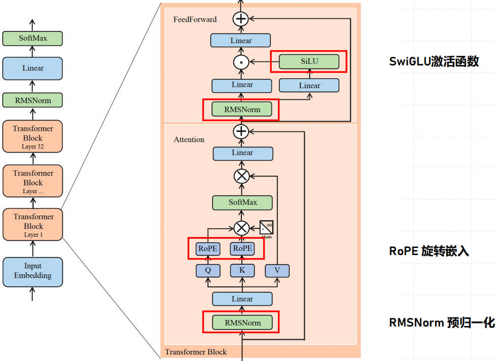

### 【零】模型介绍

***

> Meta 于 2023年 开源的 LLM 模型：LLaMA-1 和 LLaMA-2

> 揭露了一个很重要的事实：基于公开的数据集，使用较小的参数规模（7B，13B，34B，70B）就能预训练出接近 GPT-3.5 性能的模型

***

### 【一】LLaMA-1

***

> Meta 在 2023 年 3 月 开源的大模型，**LLaMA-1**，非常的哇塞

#### 【1.1】基座模型

***

> 基本的超参数如下

> LLM 的基座大模型一般都分为几个，基本架构相同，参数量不同，1.0 - 1.4 万亿的 token 非常夸张

> 训练过程 Loss 的变化是 LLM 中一个很大的难题，稳定的训练要求 batch size 很大

***

#### 【1.2】训练数据集

***

> 7 个不同来源的数据集

> 了解下这些数据集，高质量的数据对于 LLM 来说非常重要

**English CommonCrawl (67%)**：通过 CCNet 管道处理 2017 至 2020 年间的五个 CommonCrawl 数据集，进行行级去重，使用 fastText 线性分类器进行语言识别以剔除非英语页面，并利用 ngram 语言模型过滤低质量内容，同时训练线性模型筛选维基百科引用页面.

**C4 (15%)**：包括经过预处理的多样化 CommonCrawl 数据集，通过去重和语言识别改善性能，C4 数据集的质量过滤主要基于 标点存在与否 以及 网页的单词和句子数量 等启发式规则.

**Github (4.5%)**：使用 Google BigQuery 上公开的 GitHub 数据集，仅包括 Apache、BSD 和 MIT 许可的项目，并基于行长度和字母数字字符比例等启发式规则过滤低质量文件，通过正则表达式移除样板内容，以文件为单位进行去重.

**Wikipedia (4.5%)**：添加 2022年 6 月至 8 月 期间的 20 种语言（使用拉丁或西里尔字母）的 Wikipedia 数据集，处理数据以移除超链接、注释和其他格式化样板内容.

**Gutenberg **和 **Books3 (4.5%)**：包含两个书籍语料库，即公共领域的 古腾堡项目 和 大型语言模型训练用的公开数据集 “The Pile” 的 Books3 部分，进行书籍级去重，剔除内容重叠超过 90% 的书籍.

**ArXiv (2.5%)**：处理 ArXiv LaTeX 文件以添加科学数据，移除第一节之前的所有内容和参考文献，删除 .tex 文件中的注释，并内联展开用户编写的定义和宏以增加跨论文的一致性.

**Stack Exchange (2%)**：包含多个领域（从计算机科学到化学）的高质量问题和答案网站 Stack Exchange 的数据集，保留了 28 个最大网站的数据，移除了文本中的 HTML 标签，并按得分（从高到低）对答案进行排序.

***

#### 【1.3】模型架构改进

***

> 主要有三点改进：RMSNorm 预归一化，SwiGLU 激活函数，RoPE 旋转嵌入

##### 【1.3.1】RMSNorm 预归一化

***

> 来源于 GPT-3：在Transformer 各层的输入进行归一化，以提高训练稳定性.

***

##### 【1.3.2】SwiGLU 激活函数

***

> 来源于 PaLM：用 SwiGLU 激活函数替换了 ReLU 非线性函数，以提升Transformer 性能.

> 主流激活函数对比

***

##### 【1.3.3】RoPE 旋转嵌入

***

> 来源于 GPT-Neo：移除了绝对位置嵌入，改为在网络的每一层添加旋转位置嵌入

***

#### 【1.4】LLaMA-1 预训练效率优化

***

> 为提升模型训练速度，Meta 团队进行了多项优化

##### 【1.4.1】因果多头注意力

***

> 采用 xformers 库的因果 多头注意力 实现，减少显存使用和运行时间. 

> 不存储注意力权重，且不计算由于语言建模任务的因果性质而被掩盖的key / query 分数来实现.

***

##### 【1.4.2】减少重复激活计算

***

> 在反向传播过程中通过检查点技术，减少了需要重新计算的激活量.

> 具体来说：保存计算成本高的激活输出，如线性层的输出. 这是通过手动实现 Transformer 层的反向传播函数（替代 PyTorch autograd）完成的.

***

##### 【1.4.3】模型并行 / 流水线并行

***

> 尽可能调度使得激活值计算和GPU间网络通信重叠，提升效率

***

### 【二】LLaMA 生态

***

> LLaMA 开源后整个生态开始迅速发展，**Alpaca** 和 **Vicuna** 作为衍生模型尤为突出

***

#### 【2.1】Stanford Alpaca 7B

***

> 来自斯坦福大学，基于合成数据（使用 textdavinci-003 生成）进行指令微调，随后这种造数据的方式火起来了

**初衷**：像 GPT-3.5（text-davinci-003）、ChatGPT、Claude 和 Bing Chat 这样的 **指令跟随（Instruction-following ）**模型变得越来越强大. 现在许多用户经常与这些模互动，甚至将它们用于工作. 然而，尽管广泛部署，指令跟随模型仍然存在许多不足之处：它们可能生成虚假信息、传播社会刻板印象并产生有毒语言.

**Alpaca** 是一个指令跟随语言模型，从 **Meta‘s LLaMA 7B** 模型微调而来. 使用以 textdavinci-003 风格自我指导（selfinstruct）生成的 52K 个指令跟随演示来训练Alpaca 模型. 在自我指导评估数据集上，Alpaca 表现出许多类似于 OpenAI text-davinci-003 的行为，并且惊人地小巧、易于复制和廉价（不到600美金）.

***

#### 【2.2】Vicuna 13B

***

> 来自多家研究机构（UC Berkeley，CMU，斯坦福，US San Dego 和 MBZUAI），基于对话数据

**Vicuna** 是在 LLaMa 1-13B 的基础上使用监督数据微调得到的模型，数据集来自于 **ShareGPT** 产生的 70K 条用户对话数据，增强了 Alpaca 提供的训练脚本，以更好地处理多轮对话和长序列. 相较于Alpaca，Vicuna 在训练中将序列长度由 512 扩展到了 **2048**，并且通过 梯度检测 和 **flash attention** 来解决显存问题；针对多轮对话来调整训练损失，并仅根据模型的输出进行微调. 通过 **GPT4** 来打分评测，Vicuna 可以达到 **ChatGPT 90%** 的效果.

***

### 【三】LLaMA-2

***

> Meta 在 LLaMA 1 发布后，时隔半年推出第二代 LLaMA，大名鼎鼎的 **LLaMA-2**

#### 【3.1】与 LLaMA 1 对比

***

> 长文本，更多的训练数据（2 万亿 token）

***

#### 【3.2】LLaMA 2 - Chat 训练方法

***

> 在 **100** **万人类标记数据** 上进行 **RLHF** 训练得到 **LLaMA 2-Chat** 模型

***

#### 【3.3】CodeLlama

***

