### 【零】MoEs 介绍

***

> MoEs（Mixture-of-Experts，混合专家模型）

***

### 【一】Adaptive Mixtures of Local Experts（1991）

***

> MoES 开山鼻祖，**Michael I. Jordan&Hinton** 于 1991 年发布的论文，自适应局部专家混合

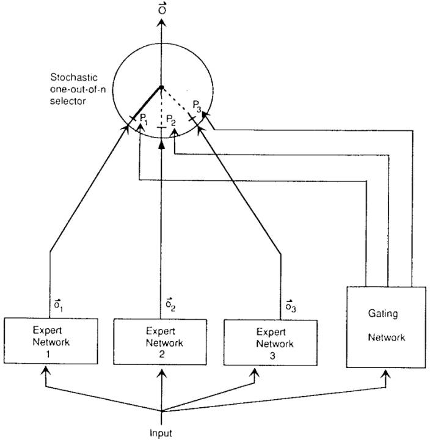

* **混合专家模型**：提出了一种有效减弱干扰效应的模型结构，设立多个独立的子网络（“专家”）来处理不同的输入数据子集（子任务），从而实现学习网络独立的权重更新。
* **门控网络**：除了专家网络，这个模型还引入了一个称为 “门控网络”（Gating Network）的结构。门控网络的职责，根据输入数据决定使用哪个专家网络（或组合）处理当前输入。
* **自适应学习**：同时对每个专家和门控网络进行训练，模型可以根据数据自适应地改变每个专家的权重和作用。

***

### 【二】**Learning Factored Representations in a Deep Mixture of Experts**（2013）

***

> 深度 MoEs，来自 **Ilya**，将 MoE 变成深度网络中的一个模块

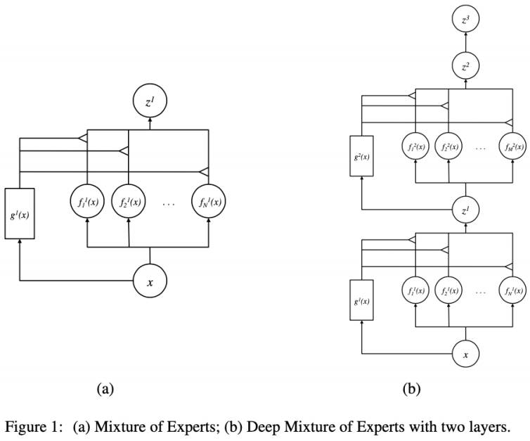

* **结合深度学习与MoE**：提出一种将深度神经网络与混合专家模型相结合的架构（DMoE），支持将 DNN 中的层作为 MoE 来训练，使其能够应用于更深层次的网络结构。
* **分解表示：**该模型着重于学习输入数据的分解表示（factored representations），这意味着每个专家网络学习数据的一部分特征或模式，而这些特征在整个模型中被综合起来形成完整的数据表示。
* **高效处理复杂数据：**通过在深度网络中应用分解表示和专家模型，展示了如何更有效地处理高维和复杂的数据集。

***

### 【三】稀疏门控 MoE (2017)

***

> 超大网络，来自 **Hinton** 和 **Jeff Dean**，首次将 MoEs 应用在 RNN 网络中

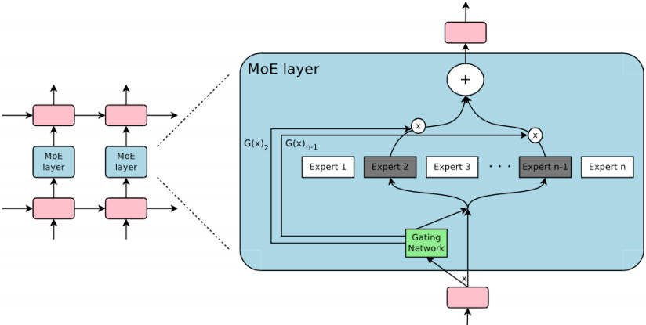

* **构建大型 MoE 模型**：提出了一种模型架构，在堆叠的 LSTM 层之间卷积应用高达 1370 亿参数的 MoEs。
* **引入稀疏性概念**：研究中介绍了由数千个前馈子网络组成的 Sparsely-Gated Mixture-of Experts 层（MoE）。通过训练的门控网络为每个样例确定使用哪些专家的稀疏组合。
* **实现了条件计算目标**（网络的某些部分仅针对特定样本激活）：在不增加计算量的情况下扩大模型规模成为可能，从而在每层 MoE 中使用了数千名专家。

***

### 【四】GShard（2020）

***

> Google：基于 MoE 探索巨型 Transformer 网络，可以看作是一种训练 MoEs 的方法

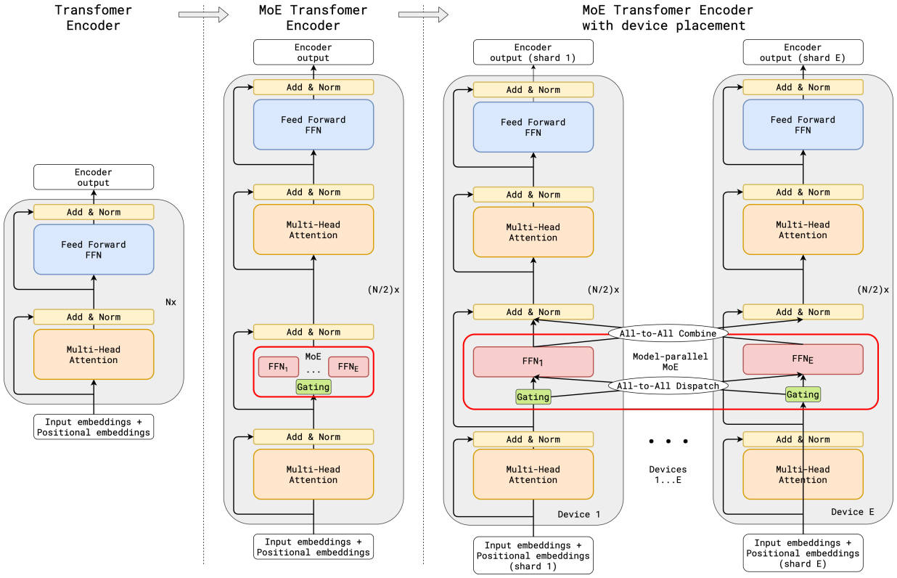

* 【创新1】**随机路由机制**：在 top-2 设计中，我们始终选择表现最优的专家，但第二选择的专家则根据其权重以一定概率被选中。
* 【创新2】**专家处理能力限制**：我们可以设定一个专家能处理的 Token 数量的上限。如果两个专家的处理能力都已达到上限，那么这个 Token 就会被认为是多余的，并通过残差连接传递到下一层，或在某些情况下被直接丢弃。这一概念在 MoEs 的应用中非常关键。
* 【注意】模型所有的张量形状（Tensor Shape）都是静态确定的，但无法预先知道每个专家将处理多少 Token，因此需要设定一个固定的处理能力上限。

***

### 【五】GaLM（2021）

***

> Google：GLaM (Generalist Language Model，通才语言模型)，整体规模达到了 1.2万亿 参数量

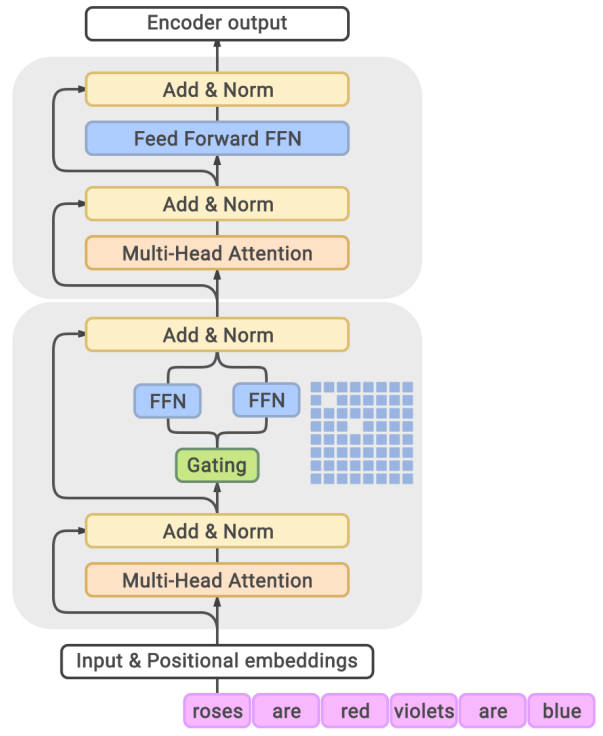

* GLaM 展示了如何通过采用稀疏激活的混合专家架构，在提高模型容量的同时降低训练成本。相比 GPT-3 模型，训练所需能源 1/3，推理计算量 1/2。
* GLaM 的成功实验表明，通过智能设计和优化架构，可以在资源消耗和性能之间取得更好的平衡，这对于未来大规模语言模型的开发具有重要意义。

***

### 【六】Switch Transformer（2022）

***

> Google：经典的 Encoder-Decoder 架构，两个路由器 Router，分别选择不同的专家进行处理

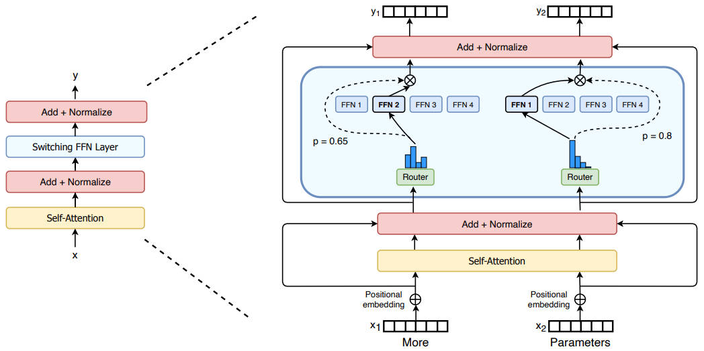

* 专家容量（capacity）：

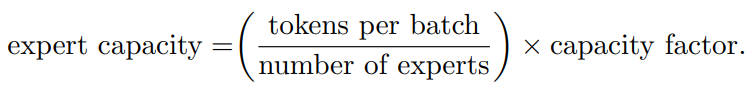

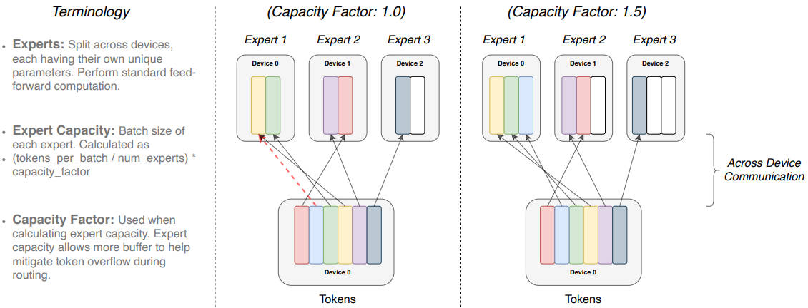

* 多卡模型并行和数据并行：

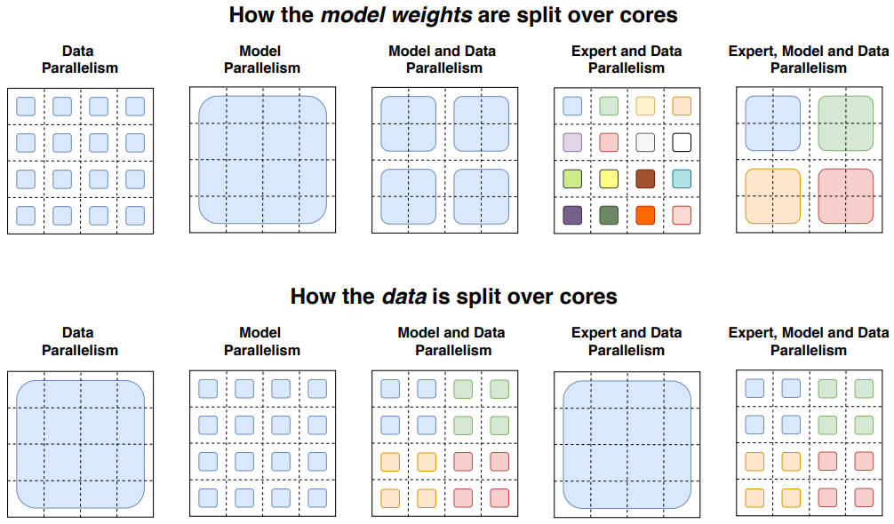

***

### 【七】Mixtral 8x7B（2024）

***

> Mistral：Decoder-only 架构的 MoEs，非常强大

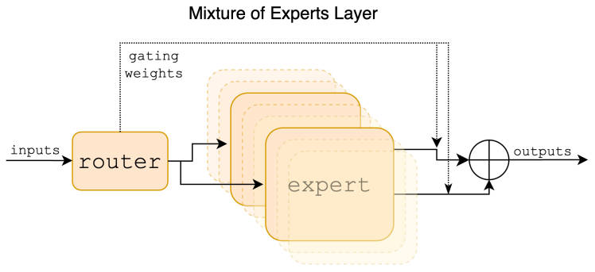

* Mixtral 8x7B 是一种 decoder-only 的模型，每层由 8 个前馈块（即专家）组成。对于每个 token，在每一层，路由器网络都会选择两名专家来处理当前状态并组合他们的输出。尽管每个 token 只看到两个专家，但所选的专家在每个时间步上都可能不同。因此，每个 token 可以访问 47B 参数（9B 参数共享），但在推理过程中仅使用 13B 激活参数。

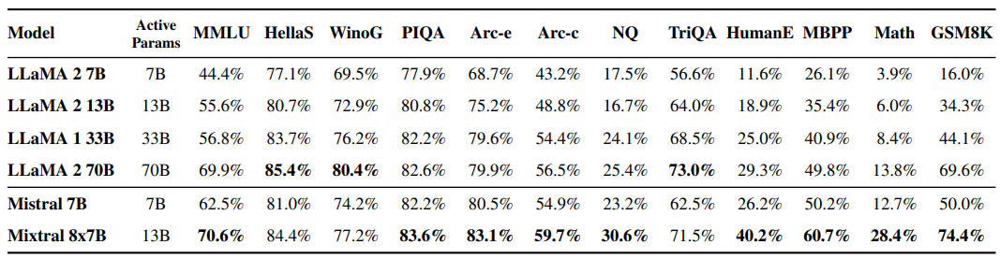

* Mixtral 预训练上下文的大小为 32k，在多项基准测试中，它的性能达到或超过 Llama 2 70B 和 GPT-3.5。尤其是，Mixtral 在数学、代码生成和需要多语言理解的任务方面表现出了卓越的能力，并在这些领域显著优于 Llama 2 70B。实验表明，Mixtral 能够成功地从 32k token 的上下文窗口中检索信息，无论序列长度和信息在序列中的位置如何。

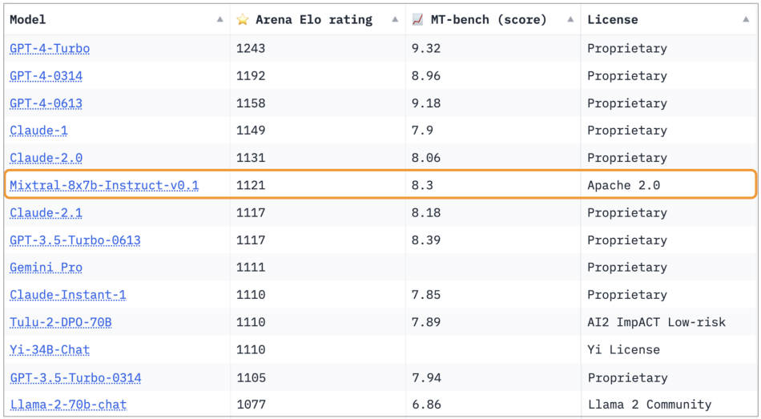

* 除了 Mixtral 8x7B，该研究还推出了 Mixtral 8x7B – Instruct 聊天模型，其性能在人类评估基准上明显超过了 GPT-3.5 Turbo、Claude-2.1、Gemini Pro 和 Llama 2 70B 聊天模型。在 BBQ 和 BOLD 等基准中，Mixtral - Instruct 也显示出更少的偏见。

***

