### 【零】LoRA 背景

***

> 前期主流的 PEFT 存在几个问题：

> **Adapter**：增加了模型深度，从而增加了模型推理时延

> **Prefix Tuning** / **Prompt Tuning** / **P-Tuning**：Prompt 训练难度大，同时缩短了模型可用的序列长度

***

### 【一】LoRA

***

> 2021年，来自微软的杰作，将 PEFT 推向顶峰

> 论文：[LORA: LOW-RANK ADAPTATION OF LARGE LANGUAGE MODELS](https://arxiv.org/pdf/2106.09685)

#### 【1.1】核心结构

***

>为了使微调更加高效，LoRA 的方法是通过 **低秩分解** 将权重更新表示为 **两个** 较小的矩阵（称为 **更新矩阵**）。这些新矩阵可以在适应新数据的同时保持整体变化数量较少进行训练。原始权重矩阵保持冻结状态，并且不再接受任何进一步的调整。最终结果是通过将原始权重和适应后的权重进行组合得到。

> 在 LoRA 方法中，实际上是在原始预训练语言模型（PLM）旁增加一个附加的网络通路，这可以视作一种 **“外挂”** 结构。这个外挂结构的目的是通过两个矩阵 A 和 B 的相乘来模拟 **本征秩**（Intrinsic rank）。

> A 矩阵用 **正态分布** 初始化，B 矩阵初始化为 **0**。这是因为需要尽量减少刚开始训练时的不稳定性，让前期更新的向量空间和原本的向量空间不要偏离太远。

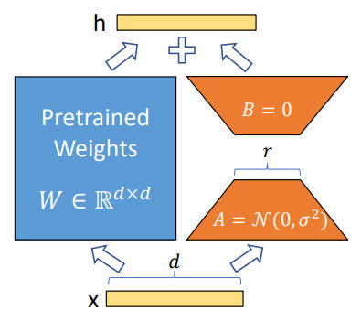

* 简单理解的数学公式

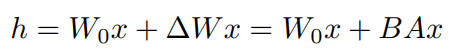

* **整体设计**：A B 两个小模型（矩阵）的输入和输出的维度分别为d，这与预训练模型层的维度相同。
* **低秩分解**：A 矩阵会将输入的 d 维数据降维至 r 维（增量矩阵的本征秩），r 远小于 d（r<< d）。矩阵计算从 d x d 变为d x r + r x d。
* **回映射**：B 矩阵将这些 r 维数据再映射回 d 维，以便与预训练模型的其他部分保持兼容。

***

#### 【1.2】对比 Adapter 方法

***

* **推理性能高效**：

  * 与 Adapter 方法相比，LoRA 在推理阶段直接利用训练好的 A、B 低秩矩阵替换（叠加）原预训练模型的对应参数。这种替换避免了增加网络深度所带来的额外计算量和推理延时。

  * LoRA 方法使得推理过程与全参数微调（Full-finetuning）相似，但并不增加额外的计算负担。保持了高效的推理性能，同时实现了对模型的有效调整。

* **模拟全参数微调的效果**：
* LoRA 通过对模型关键部分的低秩调整，实际上模拟了全参数微调的过程。这种方法几乎不会导致训练效果的损失，后续实验结果也证明了这一点。

***

#### 【1.3】对比 Soft Prompts 方法

***

* **更深层次的模型修改**：

  * LoRA 通过修改模型的权重矩阵，直接影响模型的内部表示和处理机制，而不仅仅是输入层级。这意味着 LoRA 能够在模型的更深层次上产生影响，可能导致更有效的学习和适应性。

* **无需牺牲输入空间**：

  * Soft prompts 通常需要占用模型的输入空间，这在有限的序列长度下可能限制了其他实际输入内容的长度。

  * LoRA 不依赖于 Prompt 调整方法，避免了相关的限制，因此不会影响模型能处理的输入长度。

* **直接作用于模型结构**：

  * LoRA 通过在模型的特定层（如 Transformer 层）内引入低秩矩阵来调整模型的行为，这种修改是直接作用于模型结构的。

  * 相比之下，soft prompts 更多是通过操纵输入数据来影响模型的输出。

* **更高的灵活性和适应性**：

  * LoRA 提供了更大的灵活性，在不同的层和模型部件中引入低秩矩阵，可以根据具体任务进行调整。这种灵活性使得 LoRA 可以更精细地调整模型以适应特定的任务。

* **模拟全参数微调的效果**：

  * LoRA 的设计思路是模拟全参数微调的过程，这种方法通常能够带来更接近全面微调的效果，尤其是在复杂任务中。

***

#### 【1.4】Weight Type 和 r 的选择

***

> 很有意思，也是使用 LoRA 的时候需要考虑的问题，就是要调那部分参数？以及本征秩 r 应该设置为多少？

> HuggingFace 上面开源了一些针对不同模型的经验值：

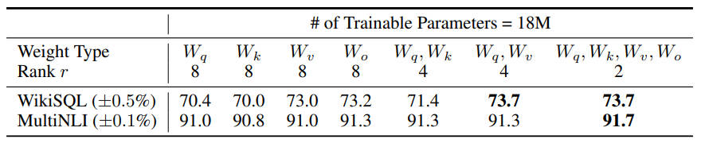

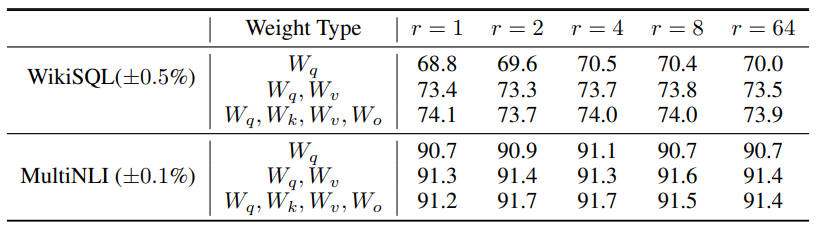

***

#### 【1.5】LoRA 存在的问题

***

* **预先指定** 超参数增量矩阵的本征秩 r，无法自适应调整。A B 矩阵都不是正交矩阵，增删列向量或行向量会对结果产生较大影响。

* 低估了 **权重矩阵的种类**（选哪些权重矩阵，怎么选）和 **不同层**（哪些层更重要），对微调效果的影响。

* 只微调了 Attention，忽略了 **FFN** 模块。

***

### 【二】AdaLoRA

***

> 2023年，来自 乔治亚理工，普林斯顿 和 微软，涉及比较多的底层数学知识

> 论文：[ADALORA: ADAPTIVE BUDGET ALLOCATION FOR PARAMETER-EFFICIENT FINE-TUNING](https://arxiv.org/pdf/2303.10512)

#### 【2.1】SVD 分解

***

> SVD：Singular Value Decomposition，奇异值分解

> SVD 是一种在数学和信号处理中常用的矩阵分解技术，用在 LoRA 中可以提升低秩分解的性能

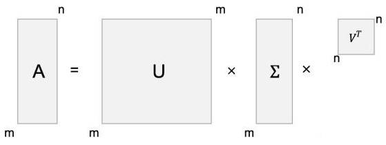

* 数学公式：对于任意一个矩阵 **A / M**，SVD 表示为 **M = UΣV^T**，其中 **U** 和 **V** 是正交矩阵，表示左右奇异向量；**Σ** 是对角矩阵，对角线上的元素是奇异值

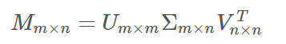

* LoRA 变换：

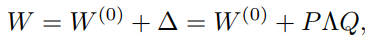

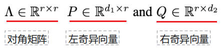

* 正则项，确保 P 和 Q 的正交性：

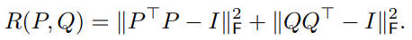

***

#### 【2.2】重要性建模

***

> 通过重要性建模，确定那些参数是需要被更新的

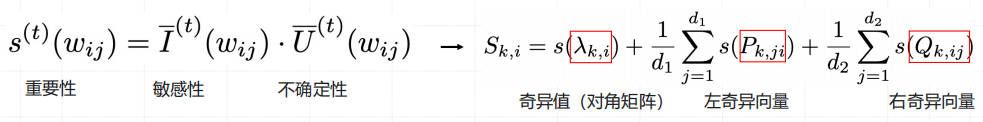

> 敏感性建模 和 不确定性建模

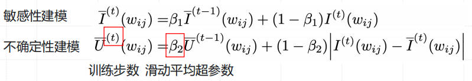

***

#### 【2.3】模型剪枝 & 自适应 r

***

* 重要性评分

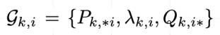

*  目标函数

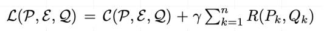

* 第 t 步参数更新

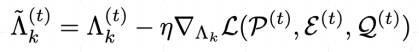

* 第 t 步模型剪枝

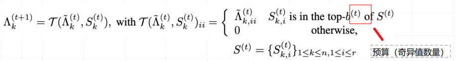

* 预算 ≈ 可训练参数量（逐步衰减）

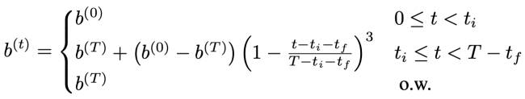

***

#### 【2.4】实验结果

***

> 不同层的不同模块，对应的 r 也不同，还是挺复杂的，实验结果页显示了 AdaLoRA 几乎全面超越了 LoRA，虽然超越的感觉并不是很多

> 启发性：这结果显示每个 Transformer 层的 f1 是挺重要的，并且越往后的层保留的信息越多

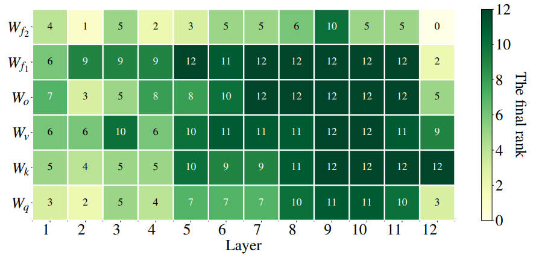

***

### 【三】QLoRA

***

> 2023年，来自 华盛顿大学，将 LoRA 和 量化技术 结合在一起，存算分离

> 论文：[QLORA: Efficient Finetuning of Quantized LLMs](https://arxiv.org/pdf/2305.14314)

#### 【3.1】FFT vs LoRA vs QLoRA

***

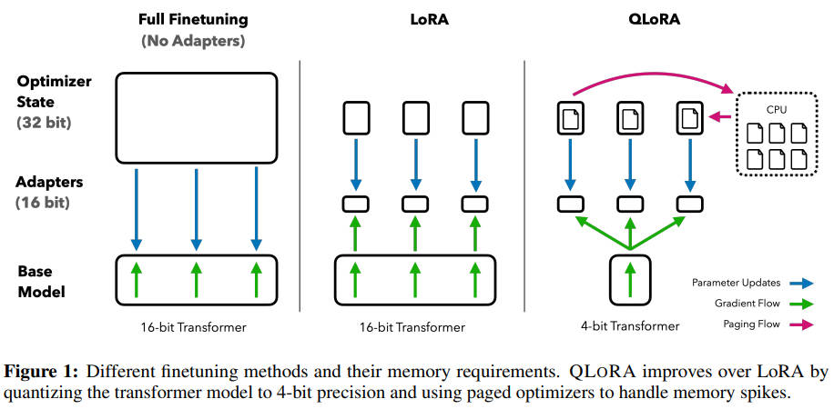

***

#### 【3.2】4-bit NormalFloat（NF4）

***

* 8-bit 量化

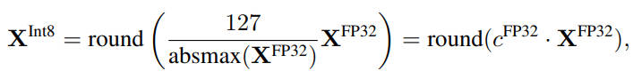

* 量化常数

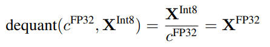

* 双量化（量化了量化常数）

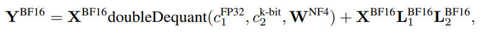

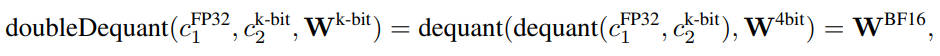

* **零中心正态分布**：在神经网络中，预训练的权重通常具有零中心的正态分布，标准差为 σ。通过缩放 σ，可以使得分布恰好适应 NF 的范围。对于NF，作者设置了一个任意的范围 [-1, 1]。因此，数据类型和神经网络权重的分位数都需要被归一化到这个范围。
  * 估计理论 N(0,1) 分布的 2^k+1 个分位数，得到正态分布的 k 位分位数量化数据类型（**NF4，k 就是 4，在 [-1, 1] 区间内有 17 个分位数**）
  * 采用这种数据类型并将其值归一化到 [−1,1] 范围内
  * 通过绝对最大缩放将其归一化到 [−1,1] 范围内来量化输入权重张量

***

#### 【3.3】实验结果

***

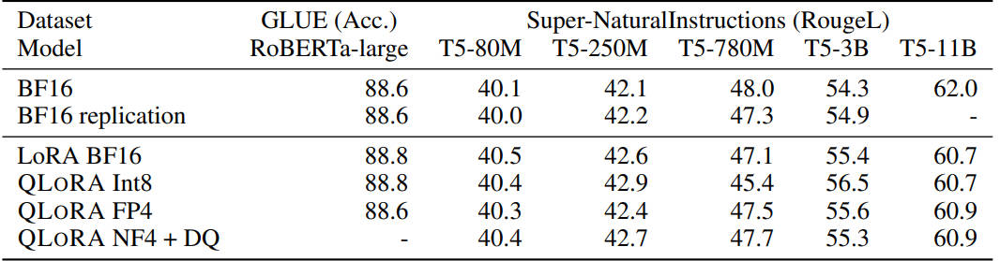

***

