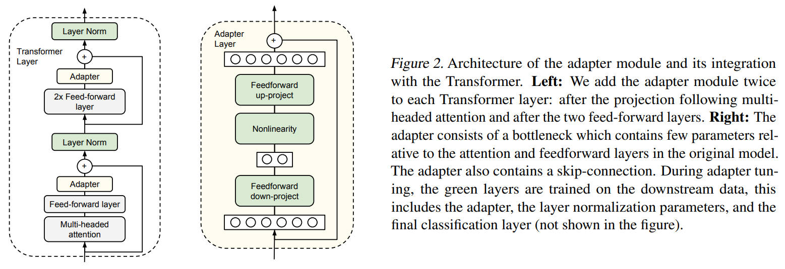
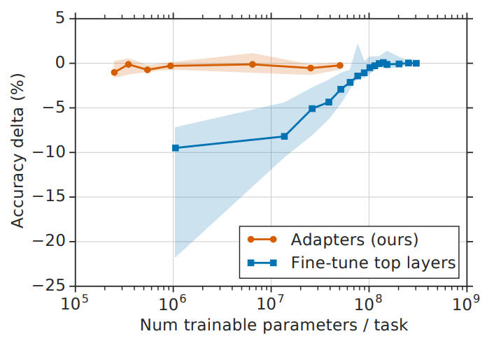
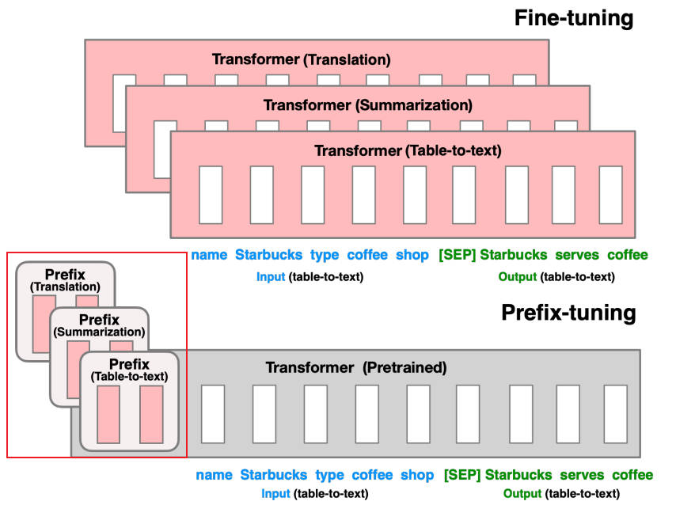
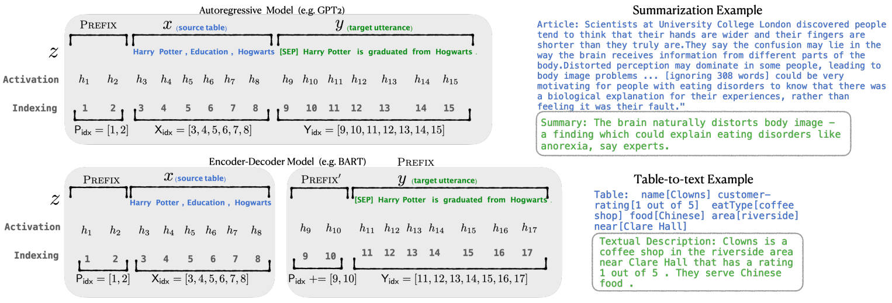
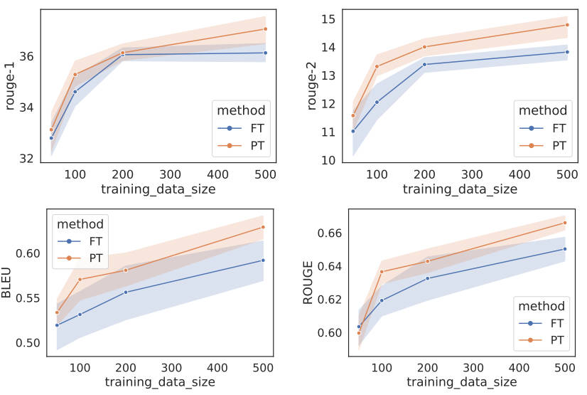
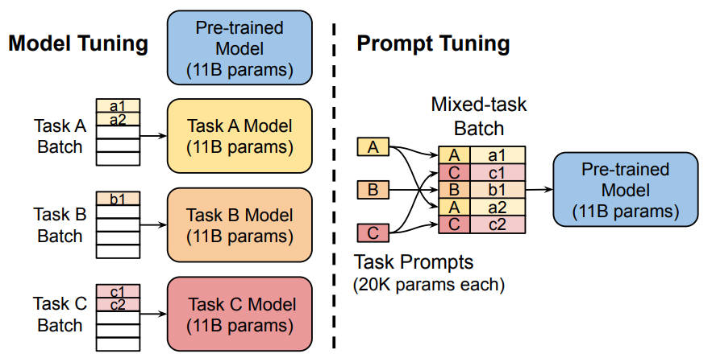
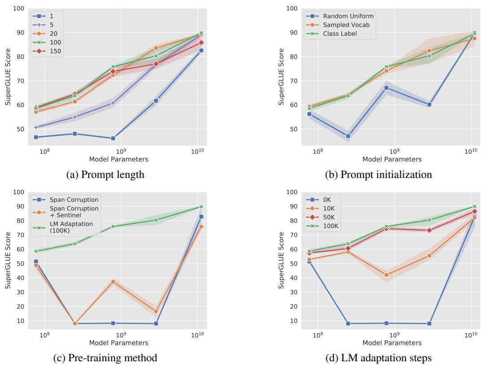
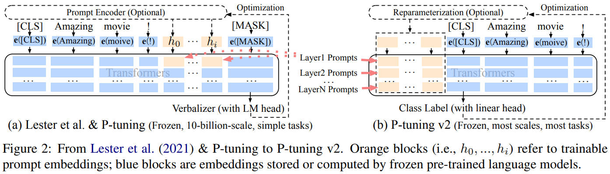
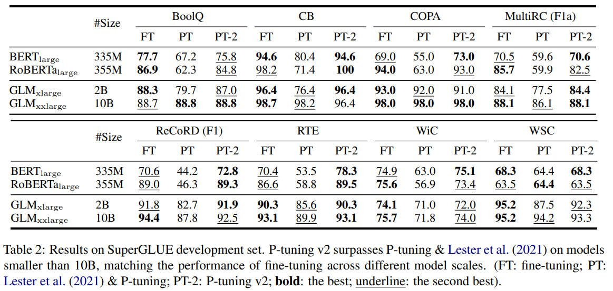

### 【零】PEFT介绍

***

> PEFT：Parameter-Efficient Fine-Tuning（高效微调）

> PEFT 是在大模型时代占据非常重要的地位，旨在将 **少量参数微调** 的性能 达到或超越 **全参数微调** 的效果

***

### 【一】Adapter Tuning

***

> 2019年，来自 Google，开启了 PEFT 先河

> 论文：[Parameter-Efficient Transfer Learning for NLP](https://arxiv.org/pdf/1902.00751)

#### 【1.1】核心结构

***

 

***

#### 【1.2】实验结果

***

 

***

### 【二】Prefix Tuning

***

> 2021年，来自 Lisa 和 Liang（Stanford），冻结预训练模型参数，在 Embedding 和 Transformer 层添加 经过 MLP 训练的特定任务前缀

> 论文：[Prefix-Tuning: Optimizing Continuous Prompts for Generation](https://arxiv.org/pdf/2101.00190)

#### 【2.1】核心结构

***

 

***

#### 【2.2】实现细节

***

***

#### 【2.3】实验结果

***

 

***

### 【三】Prompt Tuning

***

> 2021年，来自 Google 的杰作，开启 Soft Prompt 微调范式

> 论文：[The Power of Scale for Parameter-Efficient Prompt Tuning](https://arxiv.org/pdf/2104.08691)

#### 【3.1】核心结构

***

  

***

#### 【3.2】实验结果

***

> 一个很有意思的发现：当模型规模足够大时，各种超参数对于模型性能而言就失效了

 

* (a) **Prompt 长度**：在大模型上，Prompt 长度为 1 也能达到不错的效果，Prompt 长度为 20 性价比最高。

* (b) **Prompt 初始化**：Random Uniform 明显弱于其他两种。当模型达到一定规模后，方法间几乎无差。
* (c) **预训练方法**：在小模型上，LM Adaptation 效果最好。当模型达到一定规模后，方法间几乎无差。
* (d) **微调步数**：模型参数较小时，步数越多，效果越好。同样随着模型参数达到一定规模，zero shot 也能取得不错效果。

***

### 【四】P-Tuning v2

***

> 2021年，来自清华团队，Soft Prompt，旨在解决人工设计 Prompt 的问题

> 论文：[P-Tuning v2: Prompt Tuning Can Be Comparable to Fine-tuning Universally Across Scales and Tasks](https://arxiv.org/pdf/2110.07602)

#### 【4.1】核心结构

***

***

#### 【4.2】技术细节

***

* **重参数化（Reparameterization）**

  * 在 Prefix Tuning 和 P-tuning 中，多层感知机（MLP）被用来构造可训练的嵌入（embedding）。

  * P-Tuning v2 的研究发现，针对不同的任务和数据集，这种方法可能产生相反的效果，特别是在自然语言理解领域。

* **提示长度（Prompt Length）**

  * 不同任务对应的最优提示长度（Prompt Length）是不一样的。

  * 例如，在简单的分类任务中，长度为 20 的提示可能是最佳选择；而对于更复杂的任务，则需要更长的提示长度。

* **多任务学习（Multi-task Learning）**

  * 对于 P-Tuning v2 而言，多任务学习是可选的，但它可以提供更好的参数初始化，从而进一步提升模型性能。

* **分类头（Classification Head）**

  * 在 Prompt Tuning 中，使用语言模型（LM）头来预测动词是核心思路。

  * 然而，P-Tuning v2 的研究发现，在完整数据集上这种做法并非必要，且与序列标记任务不兼容。

  * 因此，P-Tuning v2 采用类似 BERT 的方式，在第一个 token 处应用随机初始化的分类头。

***

#### 【4.3】实验结果

***

 

***

