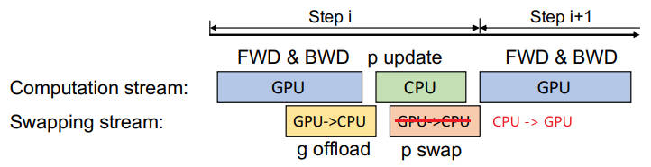

### 【零】DeepSpeed 介绍

***

> 源于微软，DeepSpeed 是一个开源深度学习优化库，旨在提高大模型训练和运行效率，以支持数 千亿 ~ 万亿 参数的超大语言模型

> 为了提高大模型训练的效率和扩展性， DeepSpeed 不仅实现了 ZeRO 论文中的核心技术，还组合了以下多个模块：

* **ZeRO**（Zero Redundancy Optimizer）：ZeRO 是 DeepSpeed 的一个关键组成部分，它通过优化数据并行训练中的显存使用，显著减少了所需的 GPU 显存。ZeRO 分为几个不同的级别（**ZeRO-DP**，**ZeRO-Offload**，**ZeRO-Infinity**），每个级别都提供了不同程度的优化和显存节省，允许训练更大的模型或在有限的硬件资源上训练模型。
* **模型并行**（Model Parallelism）：DeepSpeed 实现了模型并行技术，如：Tensor 切片，以支持大型模型的分布式训练。这些技术允许模型的不同部分在不同的计算设备上并行运行，从而处理那些单个设备无法容纳的大型模型。
* **流水线并行**（Pipeline Parallelism）：通过将模型训练分解为多个阶段，并在不同的设备上并行处理这些阶段，流水线并行技术可以进一步提高训练效率。这种方法特别适合于顺序依赖较弱的训练任务，如某些类型的深度学习模型。
* **稀疏注意力**（Sparse Attention）：DeepSpeed 支持稀疏注意力机制，这有助于降低训练大型模型（尤其是那些基于 Transformer 的模型）时的计算和内存需求。稀疏性技术可以减少不必要的计算，使模型更加高效。
* **显存和带宽优化**：DeepSpeed 采用了多种技术来优化显存使用和增加带宽效率，如异步I/O、内存池化和压缩通信等。这些优化有助于提高数据加载和模型训练过程中的效率。

***

### 【一】ZeRO - DP

***

> **Data Parallelism**：三阶段并行化技术

#### 【1.1】ZeRO Stage 1（OS）

***

> 4 倍显存压缩，将 **优化器参数**（如动量和学习率等）分布到多张卡，通信量与数据并行相同

***

#### 【1.2】ZeRO Stage 2（OS + G）

***

> 8 倍显存压缩， 进一步将 **梯度** 分布到多张卡 ，通信量仍不变

***

#### 【1.3】ZeRO Stage 3（OS + G + P）

***

>进一步将 **模型参数** 分布到多张卡，显存减少与 GPU 卡的数量（Nd）成线性关系，如，在 64 个 GPU 上分割（Nd=64）将实现 64倍 的显存压缩，通信量会适度增加 50%

***

### 【二】ZeRO - R

***

> **Residual**：进一步优化显存开销

#### 【2.1】分区激活检查点（Pa）：

***

* **原理**：模型并行（MP）设计本质上需要复制激活，导致跨模型并行 GPU 的激活冗余复制。ZeRO 通过分区激活并在计算中需要使用激活的前一刻才将其以复制形式具体化，从而消除了这种冗余。
* **过程**：一旦计算了模型的一层的前向传播，输入激活就会在所有 **模型并行进程** 中分区，直到在反向传播期间再次需要。此时，ZeRO 使用 all-gather 操作重新生成激活的复制副本。
* **内存节省**：配合激活检查点，只存储分区的 **激活检查点** 而非复制副本，可以显著减少激活占用的内存量。对于极大的模型和非常有限的设备内存，这些分区的激活检查点甚至可以卸载到 CPU 内存，将激活内存开销减少到几乎为零，但需要额外的通信成本。

***

#### 【2.2】恒定大小缓冲区（Cb）：

***

* **策略**：ZeRO 精心选择临时数据缓冲区的大小，以平衡内存和计算效率。为了提高效率，高性能库（如 NVIDIA Apex 或 Megatron）在应用这些操作前将所有参数融合到 **单个缓冲区** 中。但是，融合缓冲区的内存开销与模型大小成正比，对于大型模型可能成为障碍。ZeRO 通过使用性能高效的 **恒定大小** 融合缓冲区解决了这个问题，使缓冲区大小不依赖于模型大小。

***

#### 【2.3】内存碎片整理（Md）：

***

* **问题**：由于激活检查点和梯度计算，模型训练中出现内存碎片化。在前向传播中，仅存储选定的激活以供反向传播使用，而大多数激活被丢弃，因为它们可以在反向传播期间重新计算，导致短期和长期内存交错，从而引起内存碎片化。内存碎片化在内存充足时通常不是问题，但对于在有限内存下运行的大型模型训练，会导致内存碎片化问题，如 OOM（内存不足）和由于内存分配器花费大量时间寻找连续内存片段而导致的效率低下。
* **优化**：ZeRO 通过为激活检查点和梯度预分配连续内存块，并在生成时将它们复制到预分配的内存中，实时进行内存碎片整理。Md 不仅使 ZeRO 能够以更大的批量大小训练更大的模型，而且还提高了在有限内存下训练的效率。

***

### 【三】ZeRO 配置

***

> 参考官方配置

***

### 【四】ZeRO - Offload

***

> **Offload**：将部分数据和计算从 GPU（或其他主要训练设备）卸载到 CPU

#### 【4.1】基本架构

***

* **模型卸载**：ZeRO-Offload 可以将模型的一部分状态（如 **优化器状态**、**梯度 **或 **参数**）从 GPU 卸载到 CPU 内存中，从而减少 GPU 上的内存需求。
* **计算卸载**：除了模型卸载之外，ZeRO-Offload 还可以将一部分计算任务（如 **参数更新**）卸载到 CPU，减轻 GPU 的计算负担，使得 GPU 可以专注于更加密集的前向和反向传播计算。同时尽量减少数据在 GPU 和 CPU 之间的移动，以及减少 CPU 上的计算时间，从而在 GPU 上节省显存。
* **效率和规模**：在单个 NVIDIA V100 GPU 上可以实现 40 TFlops（万亿次浮点数运算 / 秒） 的性能，训练超过 100亿 参数的模型，相比于 PyTorch 等流行框架在单 GPU 上能训练的最大模型规模提高了 10 倍。

***

#### 【4.2】训练流程

***

* 单张 GPU

* 多张 GPU

***

### 【五】ZeRO - Infinity

***

> ZeRO-Infinity 也是 ZeRO 技术的扩展，旨在设计面向 **百万亿** 大模型的训练框架

* **全面优化**：ZeRO-Infinity 结合了数据并行、模型并行、流水线并行和 ZeRO-Offload 的优点，提供了一套全面的显存和计算优化方案 。
* **高效利用各种存储层**：通过智能地使用 GPU 显存、CPU 内存和 NVMe SSD 存储， 最大化了训练设备的存储和计算能力。
* **超大模型规模**：可以在当前一代 GPU 集群上训练高达数十甚至数百万亿参数的模型。在单个 NVIDIA DGX-2（超算）节点上微调万亿参数模型，降低了超大模型训练和微调的资源需求。
* **优秀的吞吐量和可扩展性**：在 512 个 NVIDIA V100 GPU 上保持超过 25 petaflops 的性能（达到峰值的40%），在不受 CPU 或 NVMe 带宽限制的情况下，展示了超线性的可扩展性。
* **开源友好**：Microsoft 在 DeepSpeed 框架中开源实现了 ZeRO-Infinity 技术。

***

### 【六】并行化技术

***

> 包括 **数据并行**，**模型并行** 和 **流水线并行** 三种并行化技术

#### 【6.1】数据并行（Data Parallelism）

***

> 将不同数据加载到不同的卡上

***

#### 【6.2】模型并行（Model Parallelism）

***

> 将 **模型参数** 不同部分加载到不同的卡上

***

#### 【6.3】流水线并行（Pipeline Parallelism）

***

> 将模型训练的过程（特别是前向和后向传播）分割成多个阶段，并在不同的设备上并行执行这些阶段

* 在实践中，这两种技术经常结合使用，以实现在有限硬件资源下训练大规模深度学习模型的目标。
* 例如，一个大型模型可以首先使用模型并行技术在多个设备上分割，然后在这些设备上进一步应用流水线并行技术来优化训练过程的效率。

***

