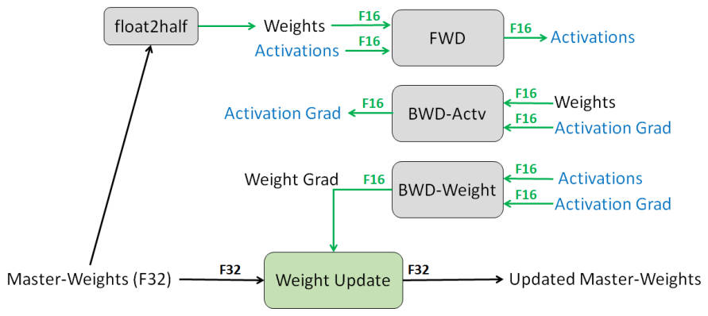
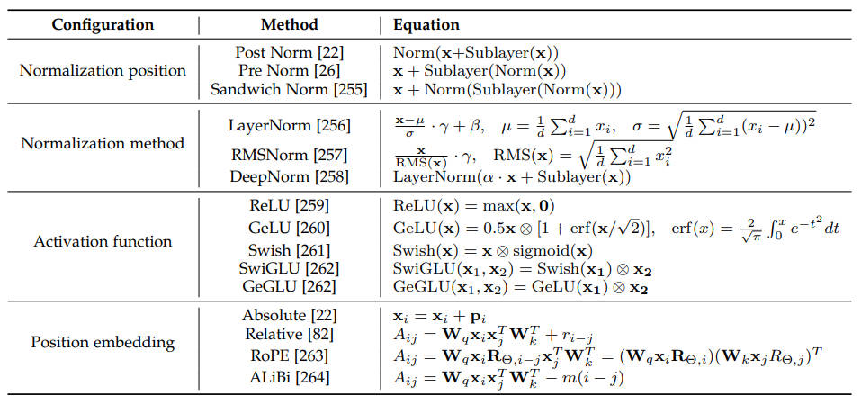
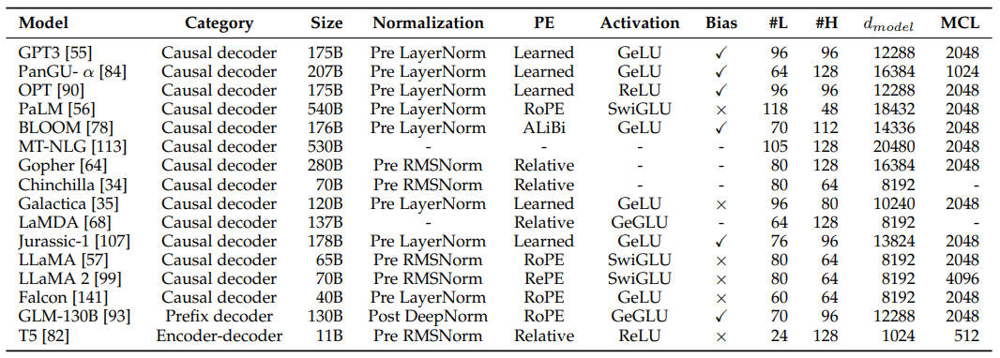
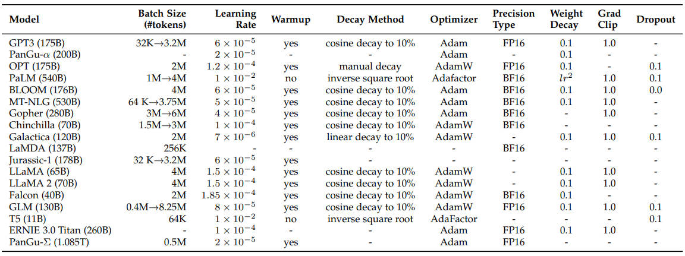

### 【零】说明

***

> 模型训练过程中会遇到一些比较零碎的概念，在这篇文档中持续更新整理

***

### 【一】显存占用计算

***

> 显存占用计算很简单，需要熟记于心

#### 【1.1】加载模型

***

> 以 Meta OPT-6.7B 模型为例（说明：Float16 精度，需要近 **13.5GB** 显存）

* **估计参数总量**：
  * OPT-6.7B 模型指一个含有大约 6.7 Billion（67亿）个参数的模型。
* **计算单个参数的显存占用**：
  * OPT-6.7B 模型默认使用 Float16，每个参数占用16位（即2字节）的显存。
* **计算总显存占用** = 参数总量 × 每个参数的显存占用：
  * 代入公式计算：67亿参数 × 2字节/参数 = 134亿字节 = 13.4×10^9字节
* **换算单位**：1GB = 2^30B ≈ 10^9 字节：
  * OPT-6.7B 以 float16 精度加载到 GPU 需要使用大约 13.5GB 显存
  * 如果使用 int8 精度，则只需要大约 7GB 显存

***

#### 【1.2】预训练模型

***

> 以 Meta LLaMA2-7B 模型为例（说明：以 bf16 混合精度预训练 LLaMA2-7B 模型，需要近 **120GB** 显存，即使 A100/H100（80GB）单卡也无法支持）

* **模型参数**（W）：
* 7B x 2Bytes ≈ 14GB
* **更新梯度**（ΔW）：
* 7B x 2Bytes ≈ 14GB
* **优化器**（AdamW），训练过程默认使用 fp32 精度：
  * 【重点】模型参数拷贝：7B x 4Bytes ≈ 28GB
  * 【重点】2倍梯度数量的动量：2 x 7B x 4Bytes ≈ 56GB
* **综上**：
  * 14GB x 2 + ( 28GB + 28GB x 2 ) = 112GB
  * 简单记为：7 x ( **2 + 2 + 12** ) = 112
* **临时变量**：
  * 另外还有一些预训练过程中的临时变量，也是需要占用显存的，向上取整 120GB 较为保险

***

### 【二】混合精度训练

***

> 一般是 **前向**（Forward）和 **后向**（Backward）使用 FP16（16-bit），**优化器** 中更新梯度时用 FP32（32-bit）

***

### 【三】典型 LLM 差异

***

> 需掌握，对各种模型架构和方法细节有个大概的了解，系统性的读下 LLM综述 论文

> 论文（LLM 综述）：[A Survey of Large Language Models](https://arxiv.org/pdf/2303.18223)

#### 【3.1】方法细节

***

***

#### 【3.2】网络架构

***

***

#### 【3.3】训练超参

***

