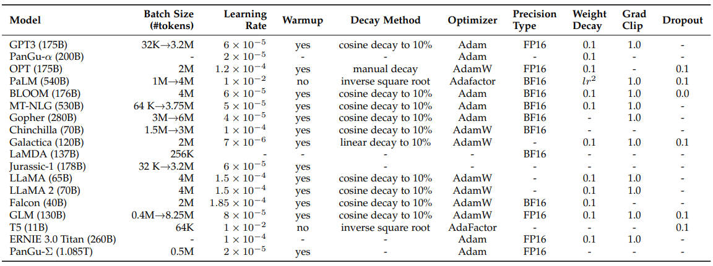

### 【LLM 经典超参】说明

***

> 模型超参数比较多，很多方法在细节上会有些差异，在这篇文档中持续跟进记录下

***

### 【一】典型 LLM 差异

***

> 需掌握，对各种模型架构和方法细节有个大概的了解，系统性的读下 LLM综述 论文

> 论文（LLM 综述）：[A Survey of Large Language Models](https://arxiv.org/pdf/2303.18223)

#### 【1.1】方法细节

***

***

#### 【1.2】网络架构

***

***

#### 【3.3】训练超参

***

