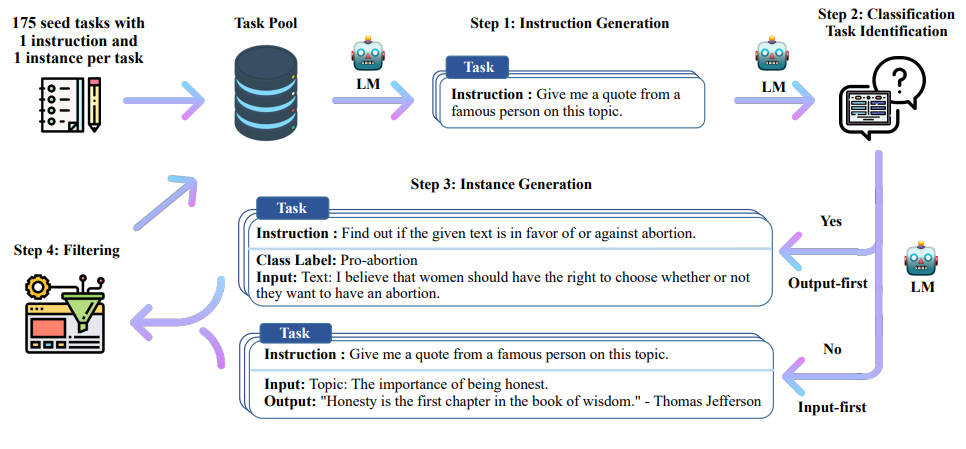

### 【指令微调】

***

> 指令微调（Instruction Tuning）在 LLM 体系中有非常重要的地位

***

### 【一】指令微调数据集

***

> 整理一些高质量的，用于指令微调的数据集

#### 【1.1】Alpaca

***

> [**alpaca**](https://huggingface.co/datasets/tatsu-lab/alpaca)：

通过 **self-instruct** 框架，使用 OpenAI 的 text-davinci-003 模型（已下线）生成的包含 52,000 条指令和文本的数据集。用于对语言模型进行指令微调，使大语言模型更好地响应 Prompt。

***

#### 【1.2】Databricks

***

> [**databricks-dolly-15k**](https://huggingface.co/datasets/databricks/databricks-dolly-15k)：

数千名 Databricks 员工按照 InstructGPT 论文中概述的类别生成的 Instruction 数据。这些行为类别包括头脑风暴、分类、封闭型问答、生成、信息提取、开放型问答和摘要。协议非常友好，CC BY-SA 3.0 license，可用于任何目的，无论是学术还是商业。

参考 **OpenAI InstructGPT** 数据比例：

文本内容生成（45.6%），开放式问答（12.4%），头脑风暴（11.2%），聊天（8.4%），文本改写（6.6%），内容摘要（4.2%），封闭式问答（2.6%），文本内容分类（3.5%），其他类型（3.5%），关键词提取（1.9%）

***

#### 【1.3】Oasst2

***

> [**oasst2**](https://huggingface.co/datasets/OpenAssistant/oasst2)：

OpenAssistant 是 LAION （非营利性组织，因 Stable-Diffusion 数据集出名）发布的一个基于聊天的助手，它能理解任务、与第三方系统进行交互，并动态地检索信息来完成任务。OpenAssistant/oasst2 数据集的发布旨在让每个人都能建设和使用强大的 chat-based 的大语言模型，一共收集了来自超过 13,000 名人类的真实聊天数据，包含信息树和标签。

***

### 【二】Self-Instruct

***

> 用 LLM 代替标注人员进行指令微调数据集的构建

***

### 【三】数据集难度评测

***

> 指令微调数据集本着 **越难越好** 的原则，让微调出来的模型性能更高

#### 【3.1】常规操作

***

* **Instruction Length**：按照指令的长度计算复杂性。
* **Perplexity**：通过预训练模型计算回复的困惑度作为复杂性指标，困惑值越大意味着数据样本越难。
* **Direct Scoring**：利用 ChaGPT（GPT-4）给指令的复杂性打分。
* **Instruction Node**：利用 ChatGPT（GPT-4）将指令转换成语义树，通过树的节点数作为复杂性指标。
* **Instag Complexity**：利用 ChaGPT（GPT-4）对部分数据进行打标签，再训练一个 Llama 模型，再利用训练后的 Llama 模型对全量数据预测，标签越多说明数据约复杂。

***

#### 【3.2】IFD

***

> Instruction-Following Difficulty（指令跟随难度）：高 IFD 分数表明模型无法将响应与给定的相应指令对齐，这反过来表明了指令的确很难

***

#### 【3.3】MoDS

***

> Model-oriented Data Selection（模型导向的数据选择）

* **Quality Evaluation**：利用奖励模型（Reward Model）筛选高质量指令数据。
* **Greedy Selection**：贪心选择策略，选择距离最远（相似度最低）的指令数据，作为种子指令数据。
* **Augmented Data Selection**：数据增强，反过来：用种子指令数据微调 LLM，然后对高质量指令数据进行重要性评估，再进行贪心选择。

***

