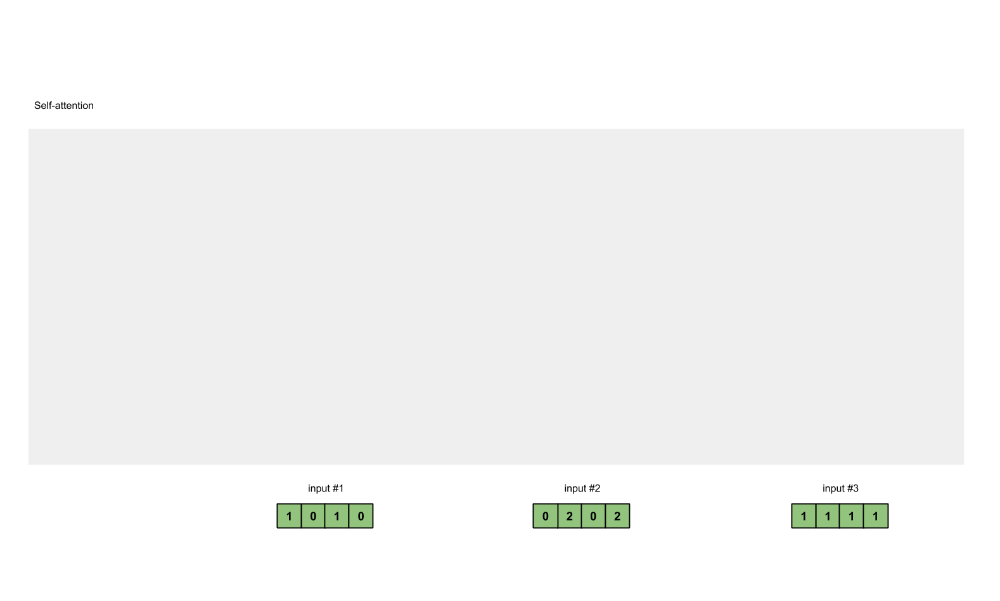
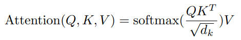

### 【八股文】

***

> 收集一些常见的 LLM 八股文知识点，比较零碎，尽量归纳总结一下



***


### 【一】Transformer 架构

***

> 作为划时代的 LLM 核心架构，[Transformer 个人博客](https://blog.csdn.net/qq_34330456/article/details/102964628)，必须掌握其中的每个模块


#### 【1.1】Self-Attention

***



***


#### 【1.2】除以 根号 d_k

***

* 首先要除以一个数，防止输入 **softmax** 的值过大，导致偏导数趋近于 **0**，造成 **梯度消失**。
* 选择根号 d_k 是因为可以使得 q*k 的结果满足期望为 0，方差为 1 的分布，类似于归一化。

***


#### 【1.3】Multi-Head Attention

***

* **提升模型的表达能力**： 每个注意力头（attention head）可以学习独特的表示，捕捉不同的特征和模式。多头注意力能够在不同子空间中并行关注信息，从而丰富整体的表示能力。
* **捕捉不同的依赖关系**： 在自然语言中，不同词汇之间可能存在复杂的依赖关系。单一的注意力机制可能无法有效捕捉所有的重要关系，而多头注意力可以同时关注句子中不同维度的关系，提供更丰富的上下文信息。

***


#### 【1.4】LLM 推理加速

***

* **KV - Cahce**：从前往后，将前面已经计算过的 Key 和 Value 存下来，新进来的 Token 在计算 Attention 时直接拿来用，推理速度会快个 4 ~ 5 倍。
* **Page Attention**：有效利用显存空间，避免空间碎片化。
* **MQA**（Multi-Query Attention），**GQA**（Group-Query Attention，慢慢成为了标准）。

***


### 【二】Python 语言

***


#### 【2.1】关键字

***

* **global**：用于在函数或其他局部作用域中声明一个 **全局变量**。通过这种声明，你可以在函数内部修改一个定义在全局作用域中的变量。
* **nonlocal**：用于在嵌套函数中使用。这种声明允许你在 **内层函数** 中修改外层（但非全局）函数中的变量。

***


#### 【2.2】深浅拷贝

***

 


#### 【2.3】装饰器

***

* 装饰器允许在不修改原有函数或类的定义的情况下，对函数或类进行包装，通过预先定义的逻辑来增强或修改它们的行为。
* 装饰器本质上是一个 Python 函数，它接受一个函数作为参数并返回一个新的函数。

```python
def my_decorator(func):
    def wrapper():
        print(1)  # 在原有函数执行前的代码
        func()
        print(2)  # 在原有函数执行后的代码
    return wrapper

@my_decorator
def my_function():
    print("这是一个需要被装饰的函数")
    
my_function()

# 1
# 这是一个需要被装饰的函数
# 2
```

* 多装饰器叠加使用（上面的装饰器将下面的装饰器作为入参，相当于 **my_decorator1 ( my_decorator2 ( func ) ) **）

```python
def my_decorator1(func):
    def wrapper():
        print('1:1')  # 在原有函数执行前的代码
        func()
        print('1:2')  # 在原有函数执行后的代码
    return wrapper

def my_decorator2(func):
    def wrapper():
        print('2:1')  # 在原有函数执行前的代码
        func()
        print('2:2')  # 在原有函数执行后的代码
    return wrapper

@my_decorator1
@my_decorator2
def my_function():
    print("这是一个需要被装饰的函数")
    
my_function()

# 1:1
# 2:1
# 这是一个需要被装饰的函数
# 2:2
# 1:2
```

***


#### 【2.4】线程 / 进程

***


#### 【2.5】同步 / 异步

***


