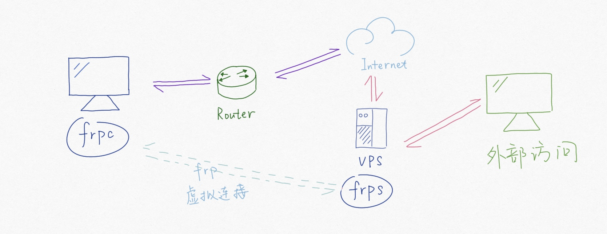

### 【炼丹炉】

***

从 0 - 1 搭建个人工作站，还挺有意思的，记录下

***


### 【一】炼丹配置

***

> 配置清单

* 机箱：联力包豪斯EVO全视版 白色
* 风扇：积木三代若干
* 主板：微星 MEG Z790 ACE 战神（EATX的板子，后续考虑扩展多一张卡，但很大，海景房差点放不下）
* 显卡：七彩虹 RTX4090 水神
* CPU：Intel 13代 19-13900KF
* 水冷：先马 SAMA XW360DW（带IPS屏）
* 内存： 金百达 KINGBANK DDR5 6400 32GB X2
* 固态：三星 MZ-V9P2T0BW 2TB PCIe4.0x4 
* 电源：海盗船 RM1200x SHIFT（选了SHIFT的导致走线很麻烦... 要跟机箱配合着来选）

* 屏幕：HKG*2 MG27U 27英寸 4K 160Hz HDR600（扫雷专用，试了下目前 4K 配 22.04 系统还可以，其他就不太行了）

* 系统：Ubuntu 22.04 LTS

***


### 【二】FRP 内网穿透

***

> FRP 内网穿透，将内网（服务器）挂载到公网上，提供外部访问机制

* 版本：v0.54.0 https://github.com/fatedier/frp/releases




#### 【2.0】准备工作

***

* **Frps**：云服务器（选择了阿里云 ECS 实例 Ubuntu 22.04 LTS）
* **Frpc**：个人深度学习服务器（Ubuntu 22.04 LTS）


#### 【2.1】Frps（服务端）

***

* ssh登录云服务器实例（秘钥认证或密码认证 官网有介绍这里不多赘述）

https://help.aliyun.com/zh/ecs/user-guide/connect-to-an-instance-by-using-third-party-client-tools/?spm=a2c4g.11186623.0.0.229622d5htvyYb

* 在 /usr/local/bin 目录下创建 frp文件夹

```she
sudo mkdir /usr/local/bin/frp
```

* 解压下载好的 frp 压缩包

```shell
tar -xzvf frp_0.54.0_linux_amd64.tar.gz
```

* 将目录下的所有内容都拷贝到 /usr/local/bin/frp 目录下

```shell
cp frp_0.54.0_linux_amd64_xxx/* /usr/local/bin/frp
```

* 修改 frp 文件夹和文件权限

```shell
chmod 755 -R /usr/local/bin/frp
```

* frps.toml

```shell
bindAddr = "0.0.0.0"
bindPort = 7000                     # frp 服务器的端口号（需要在云服务器的安全组中设置放行）
webServer.addr = "0.0.0.0"
webServer.port = 7500               # frp 网页侧的端口号（需要在云服务器的安全组中设置放行）
webServer.user = "xxx"              # frp 网页侧的登录用户名
webServer.password = "xxx"          # frp 网页侧的登录密码
auth.method = "token"               # frp 连接认证方式
auth.token = "xxx"                  # frp 连接口令
```

* 添加 system 脚本：创建 /etc/systemd/system/frps.service 文件，权限755，内容如下

```shell
[Unit]
Description=Frp Server Service
After=network.target

[Service]
Type=simple
Restart=always
RestartSec=30s
ExecStart=/usr/local/bin/frp/frps -c /usr/local/bin/frp/frps.toml
ExecStop=/usr/bin/killall frps
killMode=control-group

[Install]
WantedBy=multi-user.target
```

* 设置开机启动

```shell
sudo systemctl enable /etc/systemd/system/frps.service
```


#### 【2.2】Frpc（客户端）

***

* 在 /usr/local/bin 目录下创建 frp文件夹

```shell
sudo mkdir /usr/local/bin/frp
```

* 将 frp 压缩包里的 frpc 拷贝到该目录下，并修改读写权限

```shell
chmod 755 -R /usr/local/bin/frp
```

* frpc.toml（访问 公网IP 的 20022 端口，就相当于访问 个人深度学习服务器 的 22 端口）

```shell
serverAddr = "xxx.xxx.xxx.xxx"      # 云服务器公网IP
serverPort = 7000                   # frp 服务器的端口号
auth.method = "token"               # frp 连接认证方式
auth.token = "xxx"                  # frp 连接口令

[[proxies]]
name = "DamonDaT-SSH"               # 名称
type = "tcp"                        # 连接方式
localIP = "127.0.0.1"               # 本地深度学习服务器IP 127.0.0.1 即可
localPort = 22                      # ssh 端口号
remotePort = 20022                  # 云服务器端口号（需要在云服务器的安全组中设置放行）
```

* 添加 system 脚本：创建 /etc/systemd/system/frpc.service 文件，权限755，内容如下

```shell
[Unit]
Description=Frp Server Daemon
After=network.target

[Service]
Type=simple
Restart=always
RestartSec=30s
ExecStart=/usr/local/bin/frp/frpc -c /usr/local/bin/frp/frpc.toml
ExecStop=/usr/bin/killall frpc
killMode=control-group

[Install]
WantedBy=multi-user.target
```

* 设置开机启动

```shell
sudo systemctl enable /etc/systemd/system/frpc.service
```

***


### 【三】远程桌面

***

> 听说 XRDP（MS RDP 的开源实现）能很好支持 Gnome，尝试了一下，但界面太卡顿，可能是由于带宽和4K屏幕渲染的问题，折腾了一轮最终放弃了

> 使用场景也就是编码而已，Pycharm 支持 SSH 的 Interpreter，就直接用了，也很舒服

***


### 【四】文件共享（GUI）

***

> 尝试了下 SAMBA，但永恒之蓝虽未被波及但仍心有余悸，win11 默认关闭 445 端口，就不折腾了

> 使用 RaiDrive 中提供的 SFTP，有些广告，无伤大雅（就是图标丑了点...）

***


### 【五】ServerCat（手机端）

***

> 通过 22 端口，手机监控个人深度学习服务器的运行状态（图个乐子而已）

***


