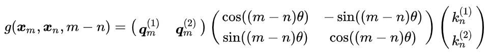
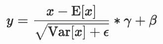
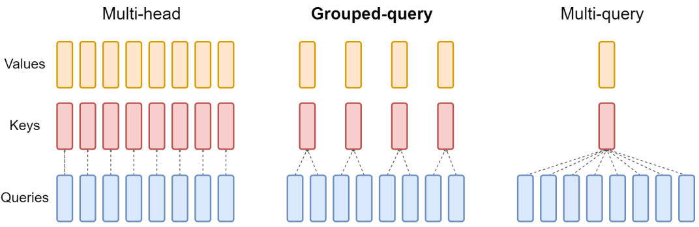

### 【零】手撕 Transformer 架构

***

> 手撕 Transformer 架构中的重要组成部分

***


### 【一】Position Embedding

***


#### 【1.1】RoPE

***

> Rotary position embedding，旋转嵌入，能够有效保留 tokens 的相对位置信息，显著提高 LLM 外推性能



```python
def precompute_freqs_cis(dim: int, end: int, theta: float = 10000.0):
    freqs = 1.0 / (theta ** (torch.arange(0, dim, 2)[: (dim // 2)].float() / dim))
    t = torch.arange(end, device=freqs.device, dtype=torch.float32)
    freqs = torch.outer(t, freqs)
    freqs_cis = torch.polar(torch.ones_like(freqs), freqs)  # complex64
    return freqs_cis.to(params.device)


def reshape_for_broadcast(freqs_cis: torch.Tensor, x: torch.Tensor):
    ndim = x.ndim
    assert 0 <= 1 < ndim
    assert freqs_cis.shape == (x.shape[1], x.shape[-1]), f'freqs_cis.shape {freqs_cis.shape} != (x.shape[1], x.shape[-1]) {(x.shape[1], x.shape[-1])}'
    shape = [d if i == 1 or i == ndim - 1 else 1 for i, d in enumerate(x.shape)]
    return freqs_cis.view(*shape)


def apply_rotary_emb(
    xq: torch.Tensor,
    xk: torch.Tensor,
    freqs_cis: torch.Tensor,
) -> Tuple[torch.Tensor, torch.Tensor]:
    xq_ = torch.view_as_complex(xq.float().reshape(*xq.shape[:-1], -1, 2))
    xk_ = torch.view_as_complex(xk.float().reshape(*xk.shape[:-1], -1, 2))
    freqs_cis = reshape_for_broadcast(freqs_cis, xq_)
    xq_out = torch.view_as_real(xq_ * freqs_cis).flatten(3)
    xk_out = torch.view_as_real(xk_ * freqs_cis).flatten(3)
    return xq_out.type_as(xq), xk_out.type_as(xk)
```

***


### 【二】Normalization

***

> 归一化，为了更加稳定的计算，加速模型收敛速度，防止梯度消失或爆炸


#### 【2.1】Layer Normalization

***

> 层归一化



```python
class LayerNorm(nn.Module):
    def __init__(self, normalized_shape, eps=1e-5):
        super(LayerNorm, self).__init__()
        self.eps = eps
        # Create two learnable parameters for normalization
        self.gamma = nn.Parameter(torch.ones(normalized_shape))
        self.beta = nn.Parameter(torch.zeros(normalized_shape))

    def forward(self, x):
        # Calculate the mean and standard deviation
        mean = x.mean(dim=-1, keepdim=True)
        std = x.std(dim=-1, keepdim=True, unbiased=False)

        # Normalize the batch of tensors
        x_normalized = (x - mean) / (std + self.eps)

        # Scale and shift
        return self.gamma * x_normalized + self.beta
```

***


#### 【2.2】RMS Normalization

***

> Root Mean Square 均方根，能显著加快模型速度，相比 LN 节省约 7% ~ 64% 的计算时间


```python
class RMSNorm(torch.nn.Module):
    def __init__(self, dim: int, eps: float = 1e-6):
        super().__init__()
        self.eps = eps
        self.weight = nn.Parameter(torch.ones(dim))

    def _norm(self, x):
        return x * torch.rsqrt(x.pow(2).mean(-1, keepdim=True) + self.eps)

    def forward(self, x):
        output = self._norm(x.float()).type_as(x)
        return output * self.weight
```

***


### 【三】Attention

***

> 注意力机制，包括传统的 **MHA**（Multi Head Attention）和几个变形，**MQA**（Multi Query Attention）和 **GQA**（Grouped Query Attention）





#### 【3.1】MHA（Multi Head Attention）

***

```python
class MultiHeadAttention(nn.Module):
    def __init__(self, hidden_size, num_attention_heads, attention_head_size):
        super(MultiHeadAttention, self).__init__()
        self.num_attention_heads = num_attention_heads

        # W^Q. Query projection layer.
        self.query_layers = nn.ModuleList([
            nn.Linear(hidden_size, attention_head_size) for _ in range(num_attention_heads)
        ])

        # W^K. Key projection layer.
        self.key_layers = nn.ModuleList([
            nn.Linear(hidden_size, attention_head_size) for _ in range(num_attention_heads)
        ])

        # W^V. Value projection layer.
        self.value_layers = nn.ModuleList([
            nn.Linear(hidden_size, attention_head_size) for _ in range(num_attention_heads)
        ])

    def forward(self, hidden_states):
        # Create a list to store the outputs of each attention head
        all_attention_outputs = []

        for i in range(self.num_attention_heads):
            query_vectors = self.query_layers[i](hidden_states)
            key_vectors = self.key_layers[i](hidden_states)
            value_vectors = self.value_layers[i](hidden_states)

            # Softmax(Q · K ^ T) * V
            attention_scores = torch.matmul(query_vectors, key_vectors.transpose(-1, -2))
            attention_scores = torch.softmax(attention_scores, dim=-1)
            attention_outputs = torch.matmul(attention_scores, value_vectors)
            all_attention_outputs.append(attention_outputs)

        return all_attention_outputs
```

***


#### 【3.2】MQA（Multi Query Attention）

***

```python
class MultiQueryAttention(nn.Module):
    def __init__(self, hidden_size, num_attention_heads, attention_head_size):
        super(MultiQueryAttention, self).__init__()
        self.num_attention_heads = num_attention_heads

        # W^Q. Query projection layer.
        self.query_layers = nn.ModuleList([
            nn.Linear(hidden_size, attention_head_size) for _ in range(num_attention_heads)
        ])

        # W^K. Key projection layer.
        self.key_layer = nn.Linear(hidden_size, attention_head_size)

        # W^V. Value projection layer.
        self.value_layer = nn.Linear(hidden_size, attention_head_size)

    def forward(self, hidden_states):
        # Create a list to store the outputs of each attention head
        all_attention_outputs = []

        for i in range(self.num_attention_heads):
            query_vectors = self.query_layers[i](hidden_states)
            key_vectors = self.key_layers(hidden_states)
            value_vectors = self.value_layers(hidden_states)

            # Softmax(Q · K ^ T) * V
            attention_scores = torch.matmul(query_vectors, key_vectors.transpose(-1, -2))
            attention_scores = torch.softmax(attention_scores, dim=-1)
            attention_outputs = torch.matmul(attention_scores, value_vectors)
            all_attention_outputs.append(attention_outputs)

        return all_attention_outputs
```

***


#### 【3.3】GQA（Grouped Query Attention）

***

```python
class GroupedQueryAttention(nn.Module):
    def __init__(self, hidden_size, num_attention_heads, attention_head_size, num_kv_heads):
        super(GroupedQueryAttention, self).__init__()
        self.num_attention_heads = num_attention_heads
        self.num_kv_heads = num_kv_heads

        # W^Q. Query projection layer.
        self.query_layers = nn.ModuleList([
            nn.Linear(hidden_size, attention_head_size) for _ in range(num_attention_heads)
        ])

        # W^K. Key projection layer.
        self.key_layer = nn.Linear(hidden_size, attention_head_size)

        # W^V. Value projection layer.
        self.value_layer = nn.Linear(hidden_size, attention_head_size)

    def forward(self, hidden_states):
        # Create a list to store the outputs of each attention head
        all_attention_outputs = []

        # The size of each group of kv
        num_queries_per_kv = self.num_attention_heads // self.num_kv_heads

        for i in range(self.num_attention_heads):
            query_vectors = self.query_layers[i](hidden_states)
            # Repeat key vectors
            key_vectors = self.key_layers(hidden_states)
            key_vectors = torch.repeat_interleave(key_vectors, num_queries_per_kv, dim=2)
            # Repeat value vectors
            value_vectors = self.value_layers(hidden_states)
            value_vectors = torch.repeat_interleave(value_vectors, num_queries_per_kv, dim=2)

            # Softmax(Q · K ^ T) * V
            attention_scores = torch.matmul(query_vectors, key_vectors.transpose(-1, -2))
            attention_scores = torch.softmax(attention_scores, dim=-1)
            attention_outputs = torch.matmul(attention_scores, value_vectors)
            all_attention_outputs.append(attention_outputs)

        return all_attention_outputs
```

***


